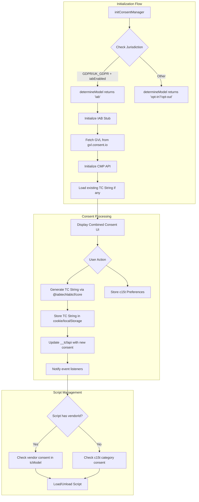

# IAB TCF 2.3 Core Support Implementation

This plan covers the first stage of IAB TCF 2.3 support in `@c15t/core`, focusing on the foundational changes needed before UI components.

**Important**: IAB TCF is an **opt-in feature**. Most c15t users don't need IAB compliance - it's primarily for publishers working with programmatic advertising vendors registered with the IAB. The implementation ensures zero bundle impact for users who don't enable it.

## Architecture Overview



## 1. Extend Model Type

Update [packages/core/src/libs/determine-model.ts](packages/core/src/libs/determine-model.ts) to support IAB mode:

```typescript
export type Model = 'opt-in' | 'opt-out' | 'iab' | null;
```

The function signature will accept a new optional parameter `iabEnabled`:

```typescript
export function determineModel(
  jurisdiction: LocationInfo['jurisdiction'],
  iabEnabled?: boolean
): Model {
  // Return 'iab' for GDPR jurisdictions when IAB mode is enabled
  if (iabEnabled && ['UK_GDPR', 'GDPR'].includes(jurisdiction)) {
    return 'iab';
  }
  // ... existing logic
}
```

## 2. Create GVL Types

Create new file [packages/core/src/types/iab-tcf.ts](packages/core/src/types/iab-tcf.ts) with TypeScript types for the Global Vendor List:

**Key types to define:**

- `GVLPurpose` - IAB TCF purpose (id, name, description, illustrations)
- `GVLFeature` - Features (1-3)
- `GVLSpecialFeature` - Special features (1-2, e.g., precise geolocation)
- `GVLVendor` - Vendor entry with purposes, legIntPurposes, features, cookieMaxAge, etc.
- `GVLStack` - Grouped purposes for simplified display
- `GVLDataCategory` - Data categories (1-11)
- `GlobalVendorList` - Complete GVL structure

**IAB Purpose IDs (1-11):**

1. Store and/or access information on a device
2. Use limited data to select advertising
3. Create profiles for personalised advertising
4. Use profiles to select personalised advertising
5. Create profiles to personalise content
6. Use profiles to select personalised content
7. Measure advertising performance
8. Measure content performance
9. Understand audiences through statistics
10. Develop and improve services
11. Use limited data to select content

## 3. Create GVL Fetcher

Create [packages/core/src/libs/gvl/fetch-gvl.ts](packages/core/src/libs/gvl/fetch-gvl.ts):

```typescript
const GVL_ENDPOINT = 'https://gvl.consent.io';

export async function fetchGVL(vendorIds?: number[]): Promise<GlobalVendorList> {
  const url = new URL(GVL_ENDPOINT);
  if (vendorIds?.length) {
    url.searchParams.set('vendorIds', vendorIds.join(','));
  }
  const response = await fetch(url.toString());
  return response.json();
}
```

## 4. IAB Purpose to c15t Consent Mapping

Create [packages/core/src/libs/gvl/purpose-mapping.ts](packages/core/src/libs/gvl/purpose-mapping.ts):

**Mapping strategy:**

- **Purpose 1** (Store/access info) -> `necessary` (required for TCF to function)
- **Purpose 2** (Limited data ads) -> `marketing`
- **Purpose 3** (Create ad profiles) -> `marketing`
- **Purpose 4** (Use ad profiles) -> `marketing`
- **Purpose 5** (Create content profiles) -> `experience`
- **Purpose 6** (Use content profiles) -> `experience`
- **Purpose 7** (Measure ad performance) -> `measurement`
- **Purpose 8** (Measure content performance) -> `measurement`
- **Purpose 9** (Audience statistics) -> `measurement`
- **Purpose 10** (Develop/improve) -> `functionality`
- **Purpose 11** (Limited data content) -> `functionality`
```typescript
export const IAB_PURPOSE_TO_C15T_MAP: Record<number, AllConsentNames> = {
  1: 'necessary',
  2: 'marketing',
  3: 'marketing',
  4: 'marketing',
  5: 'experience',
  6: 'experience',
  7: 'measurement',
  8: 'measurement',
  9: 'measurement',
  10: 'functionality',
  11: 'functionality',
};
```


## 5. Extend Script Type for Vendor Linking

Update [packages/core/src/libs/script-loader/types.ts](packages/core/src/libs/script-loader/types.ts):

```typescript
export interface Script {
  // ... existing properties
  
  /** IAB TCF vendor ID - links script to a registered vendor */
  vendorId?: number;
  
  /** IAB TCF purpose IDs this script requires (overrides category when in IAB mode) */
  iabPurposes?: number[];
  
  /** IAB TCF legitimate interest purpose IDs */
  iabLegIntPurposes?: number[];
  
  /** IAB TCF special feature IDs */
  iabSpecialFeatures?: number[];
}
```

## 6. Non-IAB Vendor Support

Create [packages/core/src/types/non-iab-vendor.ts](packages/core/src/types/non-iab-vendor.ts):

Custom vendors need the same level of transparency as IAB vendors. They must manually declare their data practices since they're not in the GVL.

```typescript
/**
 * A custom vendor not registered with IAB.
 * Must manually declare all data practices for transparency.
 */
export interface NonIABVendor {
  /** Unique identifier for the vendor */
  id: string;
  
  /** Display name */
  name: string;
  
  /** Privacy policy URL */
  privacyPolicyUrl: string;
  
  /** Description of what this vendor does */
  description?: string;
  
  // ─── Purpose Declaration (matches IAB purpose IDs 1-11) ───
  
  /**
   * IAB purposes this vendor requires consent for.
   * Uses standard IAB purpose IDs for consistency.
   * 
   * @example [1, 7, 8] // Storage, ad measurement, content measurement
   */
  purposes: number[];
  
  /**
   * IAB purposes this vendor claims legitimate interest for.
   * User can object to these.
   */
  legIntPurposes?: number[];
  
  // ─── Feature Declaration ───
  
  /**
   * Features this vendor uses (IAB feature IDs 1-3).
   * 1 = Match and combine data from other sources
   * 2 = Link different devices
   * 3 = Identify devices based on info transmitted automatically
   */
  features?: number[];
  
  /**
   * Special features requiring explicit opt-in (IAB special feature IDs 1-2).
   * 1 = Use precise geolocation data
   * 2 = Actively scan device characteristics for identification
   */
  specialFeatures?: number[];
  
  // ─── Data Declaration ───
  
  /**
   * Data categories collected/used (IAB data category IDs 1-11).
   * 1 = IP addresses
   * 2 = Device characteristics
   * 3 = Device identifiers
   * 4 = Probabilistic identifiers
   * 5 = Authentication-derived identifiers
   * 6 = Browsing and interaction data
   * 7 = User-provided data
   * 8 = Non-precise location data
   * 9 = Precise location data
   * 10 = Users' profiles
   * 11 = Privacy choices
   */
  dataCategories?: number[];
  
  // ─── Storage Declaration ───
  
  /** Maximum cookie/storage duration in seconds */
  cookieMaxAgeSeconds?: number;
  
  /** Whether this vendor uses cookies */
  usesCookies?: boolean;
  
  /** Whether this vendor uses non-cookie storage (localStorage, etc.) */
  usesNonCookieAccess?: boolean;
  
  /** How long data is retained (in days) */
  dataRetentionDays?: number;
}
```

**Example usage:**

```typescript
customVendors: [
  {
    id: 'internal-analytics',
    name: 'Our Analytics Platform',
    description: 'First-party analytics to understand site usage and improve user experience',
    privacyPolicyUrl: 'https://example.com/privacy',
    
    // What we do with data
    purposes: [1, 8, 10],           // Storage, content measurement, develop services
    legIntPurposes: [7],            // Ad measurement (legitimate interest)
    
    // How we identify users
    features: [3],                   // Identify via transmitted info (IP, user agent)
    
    // What data we collect
    dataCategories: [1, 2, 6, 8],   // IP, device chars, browsing data, non-precise location
    
    // Storage practices
    usesCookies: true,
    cookieMaxAgeSeconds: 31536000,  // 1 year
    dataRetentionDays: 365,
  },
]
```

## 7. Update Store Types

Update [packages/core/src/store/type.ts](packages/core/src/store/type.ts) to add IAB-specific state:

```typescript
export interface StoreRuntimeState extends StoreConfig {
  // ... existing properties
  
  /** Global Vendor List data (null when not in IAB mode) */
  gvl: VendorList | null;
  
  /** Whether GVL is currently being fetched */
  isLoadingGVL: boolean;
  
  /** Non-IAB vendors configured by the publisher */
  nonIABVendors: NonIABVendor[];
  
  /** IAB TCF consent string (TC String) */
  tcString: string | null;
  
  /** Per-vendor consent state */
  vendorConsents: Record<number, boolean>;
  
  /** Per-vendor legitimate interest state */
  vendorLegitimateInterests: Record<number, boolean>;
  
  /** Per-purpose consent state (IAB purposes 1-11) */
  purposeConsents: Record<number, boolean>;
  
  /** Per-purpose legitimate interest state */
  purposeLegitimateInterests: Record<number, boolean>;
  
  /** Special feature opt-ins (e.g., precise geolocation) */
  specialFeatureOptIns: Record<number, boolean>;
  
  /** CMP API controls (manages __tcfapi) */
  cmpApi: ReturnType<typeof createCMPApi> | null;
}

export interface StoreActions {
  // ... existing actions
  
  /** Set IAB purpose consent */
  setPurposeConsent: (purposeId: number, value: boolean) => void;
  
  /** Set IAB vendor consent */
  setVendorConsent: (vendorId: number, value: boolean) => void;
  
  /** Set special feature opt-in */
  setSpecialFeatureOptIn: (featureId: number, value: boolean) => void;
  
  /** Accept all IAB purposes and vendors */
  acceptAllIAB: () => void;
  
  /** Reject all IAB purposes (except necessary) */
  rejectAllIAB: () => void;
  
  /** Save IAB consents and generate TC String */
  saveIABConsents: () => Promise<void>;
}
```

## 8. Update Store Options

Update [packages/core/src/store/type.ts](packages/core/src/store/type.ts) StoreOptions:

```typescript
/**
 * IAB TCF 2.3 configuration.
 * Only configure this if you need IAB compliance for programmatic advertising.
 */
export interface IABConfig {
  /**
   * Enable IAB TCF 2.3 mode.
   * When enabled, c15t will:
   * - Fetch GVL from gvl.consent.io
   * - Initialize __tcfapi CMP API
   * - Generate TC Strings for IAB compliance
   * 
   * Note: Only works in 'c15t' client mode (requires backend)
   */
  enabled: boolean;
  
  /**
   * Your registered CMP ID with IAB.
   * Required for production IAB compliance.
   * @see https://iabeurope.eu/cmp-list/
   */
  cmpId: number;
  
  /**
   * IAB-registered vendors to include.
   * Map of vendor ID to a readable name (for self-documentation).
   * 
   * @example
   * vendors: {
   *   1: 'exponential-interactive',
   *   2: 'captify',
   *   10: 'index-exchange',
   *   755: 'google-advertising',
   * }
   */
  vendors: Record<number, string>;
  
  /**
   * Custom vendors not registered with IAB.
   * These are displayed separately in the consent UI with a note
   * that they have different privacy practices than IAB vendors.
   */
  customVendors?: NonIABVendor[];
}

export interface StoreOptions extends Partial<StoreConfig> {
  // ... existing properties
  
  /**
   * IAB TCF 2.3 configuration.
   * Most users don't need this - only enable if you work with
   * IAB-registered programmatic advertising vendors.
   */
  iab?: IABConfig;
}
```

**Usage example:**

```typescript
// Standard usage - no IAB, zero extra bundle
const manager = configureConsentManager({
  backendURL: '/api/c15t',
});

// IAB-enabled usage
const manager = configureConsentManager({
  backendURL: '/api/c15t',
  store: {
    iab: {
      enabled: true,
      cmpId: 28,
      vendors: {
        1: 'exponential-interactive',
        2: 'captify',
        10: 'index-exchange',
        755: 'google-advertising',
        793: 'amazon-advertising',
      },
      customVendors: [
        {
          id: 'internal-analytics',
          name: 'Our Analytics Platform',
          description: 'First-party analytics for site improvements',
          privacyPolicyUrl: 'https://example.com/privacy',
          purposes: [1, 8, 10],          // Storage, content measurement, develop services
          dataCategories: [1, 2, 6, 8],  // IP, device chars, browsing, location
          usesCookies: true,
          cookieMaxAgeSeconds: 31536000, // 1 year
        },
        {
          id: 'live-chat',
          name: 'Support Chat Widget',
          description: 'Customer support chat functionality',
          privacyPolicyUrl: 'https://example.com/privacy',
          purposes: [1, 5, 6],           // Storage, create content profiles, use profiles
          features: [2],                 // Link devices (for chat continuity)
          dataCategories: [3, 6, 7],     // Device IDs, browsing data, user-provided
          usesCookies: true,
          cookieMaxAgeSeconds: 2592000,  // 30 days
        },
      ],
    },
  },
});
```

The vendor map is self-documenting - developers can see at a glance which vendors they're including without looking up IDs. The names are used for:

- Code readability
- Debug logging  
- Optional validation against GVL (warn if name doesn't match)

## 9. Update Init Consent Manager

Update [packages/core/src/libs/init-consent-manager.ts](packages/core/src/libs/init-consent-manager.ts):

```typescript
async function initConsentManager(config) {
  const { iab } = config.get();
  
  // Standard flow for non-IAB
  if (!iab?.enabled) {
    // ... existing logic
    return;
  }
  
  // IAB flow - lazy load the TCF library
  const { initializeIAB } = await import('./tcf');
  
  // Extract vendor IDs from the readable map
  const vendorIds = Object.keys(iab.vendors).map(Number);
  
  // Initialize IAB stub immediately (queues __tcfapi calls)
  initializeIABStub();
  
  // Fetch GVL from consent.io (filtered by configured vendors)
  const gvl = await fetchGVL(vendorIds);
  set({ gvl, isLoadingGVL: false });
  
  // Initialize CMP API (factory function, not class)
  const cmpApi = createCMPApi({ cmpId: iab.cmpId, gvl });
  set({ cmpApi });
  
  // Load existing TC String from storage if available
  const existingTcString = loadTCStringFromStorage();
  if (existingTcString) {
    cmpApi.loadFromStorage();
  }
}
```

## 10. Update Script Loader Logic

Update [packages/core/src/libs/script-loader/core.ts](packages/core/src/libs/script-loader/core.ts):

- When in IAB mode and script has `vendorId`, check vendor consent
- When in IAB mode and script has `iabPurposes`, check purpose consents
- Fall back to existing `category` check for non-IAB scripts

## File Structure

```
packages/core/src/
├── libs/
│   └── gvl/
│       ├── index.ts              # Re-exports
│       ├── fetch-gvl.ts          # GVL fetching
│       ├── purpose-mapping.ts    # IAB to c15t mapping
│       └── types.ts              # GVL types
├── types/
│   ├── iab-tcf.ts               # IAB TCF types
│   └── non-iab-vendor.ts        # Non-IAB vendor type
└── ...
```

## 11. TC String Generation (using @iabtechlabtcf/core)

Create [packages/core/src/libs/tcf/tc-string.ts](packages/core/src/libs/tcf/tc-string.ts):

Adapt from your existing code at `desktop/v0/lib/tcf-consent.ts`:

```typescript
import { TCModel, TCString, GVL } from '@iabtechlabtcf/core';
import type { VendorList } from '@iabtechlabtcf/core';

// CMP Configuration - needs to be registered with IAB
const CMP_ID = 28; // Replace with actual registered CMP ID
const CMP_VERSION = 1;

export interface TCFConsentData {
  purposeConsents: Record<number, boolean>;
  purposeLegitimateInterests: Record<number, boolean>;
  vendorConsents: Record<number, boolean>;
  vendorLegitimateInterests: Record<number, boolean>;
  specialFeatureOptIns: Record<number, boolean>;
}

export function generateTCString(
  consentData: TCFConsentData,
  gvlData: VendorList
): string {
  const gvl = new GVL(gvlData);
  const tcModel = new TCModel(gvl);
  
  tcModel.cmpId = CMP_ID;
  tcModel.cmpVersion = CMP_VERSION;
  tcModel.consentScreen = 1;
  tcModel.consentLanguage = 'EN';
  tcModel.isServiceSpecific = true;
  
  // Set purpose consents, vendor consents, etc.
  // ... (implementation from your v0 code)
  
  return TCString.encode(tcModel);
}

export function decodeTCString(tcString: string, gvlData: VendorList): TCModel {
  const gvl = new GVL(gvlData);
  const tcModel = TCString.decode(tcString);
  tcModel.gvl = gvl;
  return tcModel;
}
```

## 12. CMP API Implementation (__tcfapi)

Create [packages/core/src/libs/tcf/cmp-api.ts](packages/core/src/libs/tcf/cmp-api.ts):

Adapt from your existing code at `desktop/v0/lib/cmp-api.ts`. Uses **functional programming** with factory functions and closures (no classes).

**Commands to support:**

- `ping` - Returns CMP status info
- `getTCData` - Returns current TC data
- `getInAppTCData` - Alias for getTCData (for mobile compatibility)
- `getVendorList` - Returns the GVL
- `addEventListener` - Subscribe to consent changes
- `removeEventListener` - Unsubscribe from changes
```typescript
import type { VendorList } from '@iabtechlabtcf/core';

interface CMPApiConfig {
  cmpId: number;
  cmpVersion?: number;
  gvl: VendorList;
}

interface CMPApi {
  updateConsent: (tcString: string) => void;
  setDisplayStatus: (status: 'visible' | 'hidden' | 'disabled') => void;
  loadFromStorage: () => void;
  destroy: () => void;
}

/**
 * Creates a CMP API instance using functional composition.
 * Installs __tcfapi on window and returns control functions.
 */
export function createCMPApi(config: CMPApiConfig): CMPApi {
  // Internal state (closure)
  let tcString = '';
  let cmpStatus: 'stub' | 'loading' | 'loaded' | 'error' = 'loading';
  let displayStatus: 'visible' | 'hidden' | 'disabled' = 'hidden';
  const eventListeners = new Map<number, CallbackFunction>();
  let nextListenerId = 0;

  // Command handlers
  const handlePing = (callback: CallbackFunction) => { /* ... */ };
  const handleGetTCData = (callback: CallbackFunction) => { /* ... */ };
  const handleAddEventListener = (callback: CallbackFunction) => { /* ... */ };
  const handleRemoveEventListener = (callback: CallbackFunction, id?: number) => { /* ... */ };
  
  const notifyEventListeners = (eventStatus: EventStatus) => {
    eventListeners.forEach((callback, listenerId) => {
      handleGetTCData((data, success) => {
        callback({ ...data, listenerId, eventStatus }, success);
      });
    });
  };

  // Install __tcfapi on window
  const initializeAPI = () => {
    if (typeof window === 'undefined') return;
    
    const previous = window.__tcfapi;
    const queuedCalls = previous?.queue || [];
    
    window.__tcfapi = (command, version, callback, parameter) => {
      switch (command) {
        case 'ping': return handlePing(callback);
        case 'getTCData': return handleGetTCData(callback);
        case 'addEventListener': return handleAddEventListener(callback);
        case 'removeEventListener': return handleRemoveEventListener(callback, parameter);
        default: callback(null, false);
      }
    };
    
    // Drain queued calls from stub
    queuedCalls.forEach(args => window.__tcfapi(...args));
  };

  initializeAPI();

  // Return public interface (no 'this', pure functions)
  return {
    updateConsent: (newTcString) => {
      tcString = newTcString;
      cmpStatus = 'loaded';
      notifyEventListeners('useractioncomplete');
    },
    setDisplayStatus: (status) => {
      displayStatus = status;
      if (status === 'visible') notifyEventListeners('cmpuishown');
    },
    loadFromStorage: () => { /* ... */ },
    destroy: () => {
      eventListeners.clear();
      delete (window as any).__tcfapi;
    },
  };
}
```


## 13. IAB Stub (for async loading)

Create [packages/core/src/libs/tcf/stub.ts](packages/core/src/libs/tcf/stub.ts):

Adapt from `desktop/v0/lib/iab-stub.ts`. The stub:

- Creates the `__tcfapi` function immediately
- Queues calls until the real CMP is ready
- Creates the `__tcfapiLocator` iframe for cross-frame communication
- Handles `postMessage` for iframe communication

## 14. Purpose Stacking (for UI)

Create [packages/core/src/libs/tcf/stacks.ts](packages/core/src/libs/tcf/stacks.ts):

Adapt from `desktop/v0/lib/iab-stacks.ts`. Groups IAB purposes into "stacks" for cleaner UI:

```typescript
// Purpose 1 always shown separately (Store/access info)
export const STANDALONE_PURPOSE_ID = 1;

export function groupPurposesIntoStacks<T extends { id: number }>(
  purposes: Array<T>,
  stacksFromAPI?: Record<string, Stack>
): {
  stacks: Array<Stack & { purposes: Array<T> }>;
  standalonePurposes: Array<T>;
}
```

## Updated File Structure

```
packages/core/src/
├── libs/
│   └── tcf/
│       ├── index.ts              # Re-exports
│       ├── fetch-gvl.ts          # GVL fetching with caching
│       ├── tc-string.ts          # TC String encode/decode
│       ├── cmp-api.ts            # __tcfapi implementation
│       ├── stub.ts               # IAB stub for async loading
│       ├── stacks.ts             # Purpose grouping for UI
│       ├── purpose-mapping.ts    # IAB to c15t mapping
│       └── types.ts              # TCF-specific types
├── types/
│   ├── iab-tcf.ts               # IAB TCF types (GVL, Vendor, etc.)
│   └── non-iab-vendor.ts        # Non-IAB vendor type
└── ...
```

## Dependencies & Bundle Considerations

IAB TCF is an **opt-in feature** - most c15t users don't need it. The implementation ensures great DX while keeping bundles lean:

1. **Bundled but lazy-loaded** - `@iabtechlabtcf/core` is included in c15t but only loaded when `iab.enabled: true`
2. **Code splitting** - IAB code in a separate chunk, loaded on demand
3. **Zero config for users** - no extra dependencies to install

**Package.json changes:**

```json
{
  "dependencies": {
    "@iabtechlabtcf/core": "^1.5.20"
  }
}
```

**Dynamic import pattern (internal):**

```typescript
// libs/tcf/lazy-load.ts
let tcfCore: typeof import('@iabtechlabtcf/core') | null = null;

export async function getTCFCore() {
  if (!tcfCore) {
    tcfCore = await import('@iabtechlabtcf/core');
  }
  return tcfCore;
}

// Usage in init
async function initializeIAB(gvlData: VendorList) {
  const { TCModel, TCString, GVL } = await getTCFCore();
  // ... use the imports
}
```

**Bundle impact:**

- Without IAB: ~0KB extra (lazy chunk not loaded)
- With IAB enabled: ~50KB loaded async on init

## Key Considerations

- **Opt-in Only**: IAB mode only activates when `iab.enabled: true` is set
- **Backend Required**: IAB mode only works in 'c15t' client mode since it requires server-side GVL hosting
- **Backward Compatibility**: Existing `category` on scripts continues to work; IAB properties are additive
- **Consent Granularity**: IAB requires per-vendor and per-purpose consent, more granular than c15t's 5 categories
- **CMP Registration**: You'll need a registered CMP ID from IAB for production use
- **TC String Storage**: Store both in localStorage and as a cookie (`euconsent-v2`) per TCF spec
- **Cross-Frame Communication**: The stub handles postMessage for iframe-embedded ads
- **Bundle Size**: ~50KB added only when IAB is used, zero impact otherwise

## Reference Implementation

Your existing code at `desktop/v0/lib/` provides working implementations that can be adapted:

- `tcf-consent.ts` - TC String generation
- `cmp-api.ts` - Full __tcfapi implementation  
- `iab-stub.ts` - IAB stub
- `iab-stacks.ts` - Purpose grouping
- `external-vendors.ts` - Non-IAB vendor structure

---

## Testing Strategy (Setting the Standard)

IAB tests should be exemplary and serve as the model for the rest of the codebase. The goal is comprehensive coverage with clear organization.

### Test File Structure

```
packages/core/src/libs/tcf/__tests__/
├── test-setup.ts           # Shared mocks, fixtures, helpers
├── fixtures/
│   ├── gvl-sample.ts       # Sample GVL data
│   ├── tc-strings.ts       # Known-valid TC strings for decoding tests
│   └── consent-scenarios.ts # Common consent state scenarios
├── fetch-gvl.test.ts       # GVL fetching tests
├── tc-string.test.ts       # TC String encode/decode tests
├── cmp-api.test.ts         # __tcfapi implementation tests
├── stub.test.ts            # IAB stub tests
├── stacks.test.ts          # Purpose grouping tests
├── purpose-mapping.test.ts # IAB to c15t mapping tests
├── integration.test.ts     # Full flow integration tests
└── compliance.test.ts      # IAB TCF spec compliance tests
```

### Test Categories for Each Module

**1. Unit Tests** (per function)

- Happy path with valid inputs
- Edge cases (empty arrays, null values, boundaries)
- Error handling (invalid inputs, network failures)
- Type safety (TypeScript types work correctly)

**2. Integration Tests** (cross-module)

- Full consent flow: init -> user action -> TC String generation
- Script loading with IAB vendor consent
- CMP API event listener notifications

**3. Compliance Tests** (IAB TCF spec)

- TC String format validation
- Required __tcfapi commands work per spec
- Event timing (cmpuishown, useractioncomplete, tcloaded)

**4. Performance Tests**

- TC String encoding/decoding speed
- Large vendor list handling
- Memory usage with many event listeners

### Mock Factories

```typescript
// test-setup.ts
import { vi } from 'vitest';
import type { VendorList, Vendor, Purpose } from '@iabtechlabtcf/core';

// ─── GVL Mock Factory ───
export function createMockGVL(overrides?: Partial<VendorList>): VendorList {
  return {
    gvlSpecificationVersion: 3,
    vendorListVersion: 142,
    tcfPolicyVersion: 5,
    lastUpdated: '2024-01-15T16:00:23Z',
    purposes: createMockPurposes(),
    specialPurposes: createMockSpecialPurposes(),
    features: createMockFeatures(),
    specialFeatures: createMockSpecialFeatures(),
    vendors: createMockVendors(),
    stacks: createMockStacks(),
    ...overrides,
  };
}

// ─── Vendor Mock Factory ───
export function createMockVendor(id: number, overrides?: Partial<Vendor>): Vendor {
  return {
    id,
    name: `Test Vendor ${id}`,
    purposes: [1, 2, 7],
    legIntPurposes: [9, 10],
    flexiblePurposes: [2, 7],
    specialPurposes: [1, 2],
    features: [1, 2],
    specialFeatures: [],
    cookieMaxAgeSeconds: 31536000,
    usesCookies: true,
    cookieRefresh: true,
    usesNonCookieAccess: false,
    urls: [{ langId: 'en', privacy: 'https://example.com/privacy' }],
    ...overrides,
  };
}

// ─── Consent State Factory ───
export function createMockTCFConsent(overrides?: Partial<TCFConsentData>): TCFConsentData {
  return {
    purposeConsents: { 1: true, 2: false, 3: false, ... },
    purposeLegitimateInterests: { 9: true, 10: true },
    vendorConsents: { 1: true, 2: true },
    vendorLegitimateInterests: { 1: true },
    specialFeatureOptIns: { 1: false, 2: false },
    ...overrides,
  };
}

// ─── Window Mock for __tcfapi ───
export function setupTCFApiMock() {
  const listeners = new Map<number, Function>();
  let listenerIdCounter = 0;
  
  const mockTcfApi = vi.fn((command, version, callback, parameter) => {
    // Implementation for testing
  });
  
  mockTcfApi.queue = [];
  
  Object.defineProperty(window, '__tcfapi', {
    value: mockTcfApi,
    writable: true,
    configurable: true,
  });
  
  return { mockTcfApi, listeners };
}
```

### Sample Test Structure

```typescript
// tc-string.test.ts
describe('TC String Generation', () => {
  let mockGVL: VendorList;
  
  beforeEach(() => {
    mockGVL = createMockGVL();
  });

  describe('generateTCString', () => {
    describe('Happy Path', () => {
      it('should generate valid TC string with all purposes consented', () => { ... });
      it('should generate valid TC string with partial consent', () => { ... });
      it('should generate valid TC string with legitimate interest', () => { ... });
      it('should include CMP metadata in generated string', () => { ... });
    });

    describe('Edge Cases', () => {
      it('should handle empty vendor list', () => { ... });
      it('should handle no consents granted', () => { ... });
      it('should handle maximum vendor ID', () => { ... });
      it('should handle special characters in vendor names', () => { ... });
    });

    describe('Error Handling', () => {
      it('should throw when GVL is null', () => { ... });
      it('should throw when GVL is malformed', () => { ... });
      it('should handle missing purpose definitions gracefully', () => { ... });
    });

    describe('Compliance', () => {
      it('should generate TC string matching IAB spec format', () => { ... });
      it('should encode version 2 header correctly', () => { ... });
      it('should set isServiceSpecific flag correctly', () => { ... });
    });
  });

  describe('decodeTCString', () => {
    describe('Happy Path', () => {
      it('should decode valid TC string correctly', () => { ... });
      it('should preserve all consent values through encode/decode cycle', () => { ... });
    });

    describe('Error Handling', () => {
      it('should throw for invalid TC string format', () => { ... });
      it('should throw for TC string version mismatch', () => { ... });
    });
  });
});
```

### CMP API Tests (__tcfapi)

```typescript
// cmp-api.test.ts
describe('createCMPApi', () => {
  let cmpApi: ReturnType<typeof createCMPApi>;
  let mockGVL: VendorList;

  beforeEach(() => {
    mockGVL = createMockGVL();
    cmpApi = createCMPApi({ cmpId: 28, gvl: mockGVL });
  });

  afterEach(() => {
    // Clean up
    cmpApi.destroy();
  });

  describe('ping command', () => {
    it('should return correct ping data when CMP is loaded', () => { ... });
    it('should return cmpStatus "stub" before initialization', () => { ... });
    it('should return correct gvlVersion from loaded GVL', () => { ... });
  });

  describe('getTCData command', () => {
    it('should return empty data before consent is given', () => { ... });
    it('should return full TCData after consent is saved', () => { ... });
    it('should include all required TCData fields per spec', () => { ... });
  });

  describe('addEventListener command', () => {
    it('should call listener immediately with current state', () => { ... });
    it('should call listener on consent change', () => { ... });
    it('should assign unique listener IDs', () => { ... });
    it('should include listenerId in callback data', () => { ... });
  });

  describe('removeEventListener command', () => {
    it('should remove listener and stop notifications', () => { ... });
    it('should return success true when listener exists', () => { ... });
    it('should handle non-existent listener gracefully', () => { ... });
  });

  describe('Event Notifications', () => {
    it('should emit "cmpuishown" when UI becomes visible', () => { ... });
    it('should emit "useractioncomplete" when user saves consent', () => { ... });
    it('should emit "tcloaded" when TC string is loaded from storage', () => { ... });
  });

  describe('Cross-Frame Communication', () => {
    it('should respond to postMessage __tcfapiCall', () => { ... });
    it('should include callId in postMessage response', () => { ... });
  });
});
```

### Integration Tests

```typescript
// integration.test.ts
describe('IAB TCF Integration', () => {
  describe('Full Consent Flow', () => {
    it('should complete consent flow: init -> display -> save -> notify', async () => {
      // 1. Initialize with iab.enabled
      // 2. Verify GVL is fetched
      // 3. Verify __tcfapi is available
      // 4. Simulate user consent
      // 5. Verify TC string is generated
      // 6. Verify event listeners are notified
      // 7. Verify scripts with vendorId are loaded/blocked correctly
    });

    it('should restore consent from storage on page reload', async () => { ... });
    it('should handle consent revocation correctly', async () => { ... });
  });

  describe('Script Loading with IAB', () => {
    it('should load script when vendor has consent', async () => { ... });
    it('should block script when vendor lacks consent', async () => { ... });
    it('should load script when all required purposes have consent', async () => { ... });
  });
});
```

### Coverage Goals

For IAB modules, target:

- **Line coverage**: > 95%
- **Branch coverage**: > 90%
- **Function coverage**: 100%

Add to `vitest.config.ts`:

```typescript
coverage: {
  thresholds: {
    'src/libs/tcf/**/*.ts': {
      lines: 95,
      branches: 90,
      functions: 100,
    },
  },
}
```