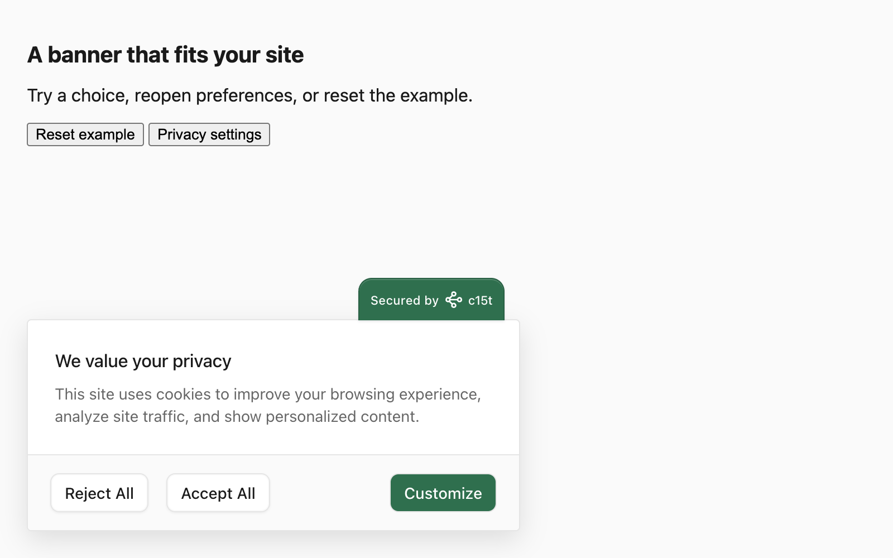
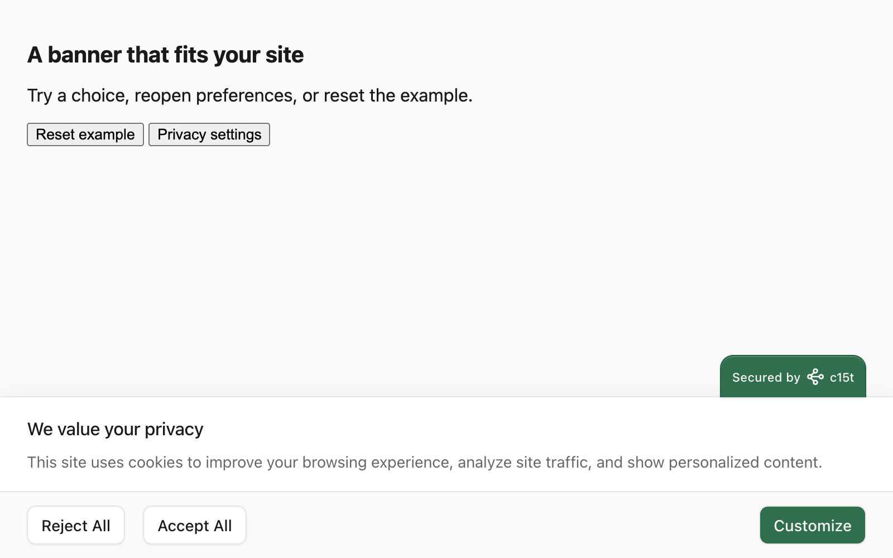
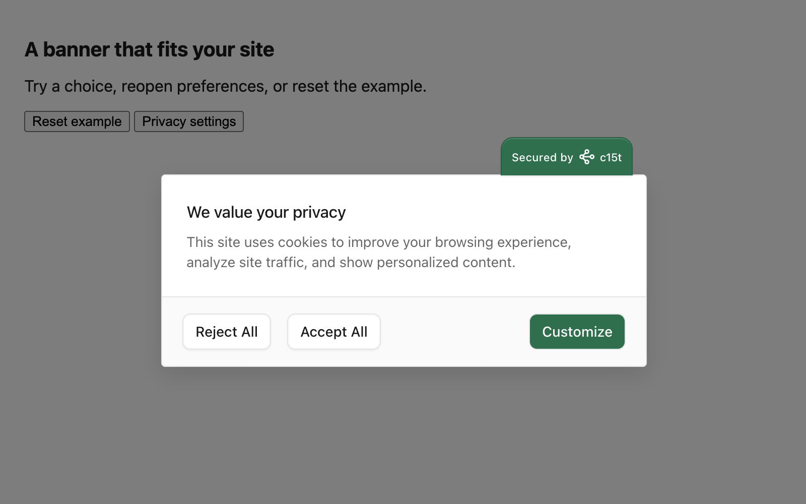
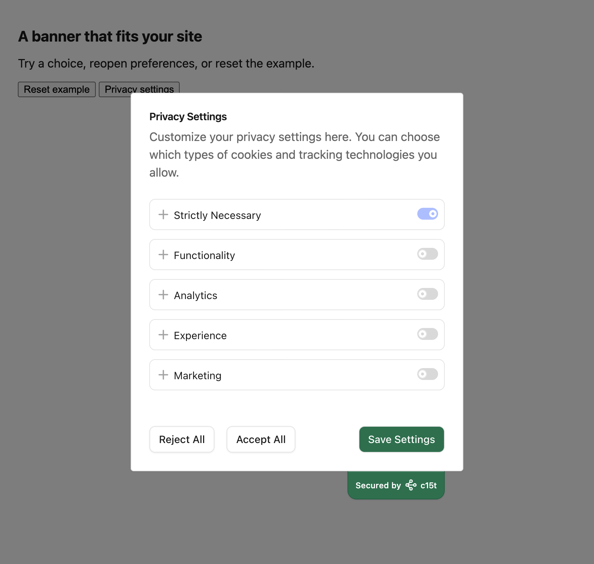
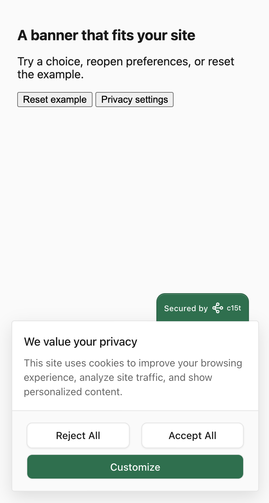

## A branded floating card

This theme uses a green primary action and a four-pixel large radius. Accept and
Reject keep matching treatment. The component's required action behavior stays
intact.



<include src="../examples/brand-theme.ts" />

Install `@c15t/ui` to use `defineTheme` directly. Pass `brandTheme` as `theme` in
your existing React or Next.js provider options. Keep your Inth mode and script
configuration. The theme source above is also imported by the runnable example,
so the rendered result and the documentation use the same values.

## Change the shape without rebuilding the banner

```tsx
<ConsentBanner variant="bar" />
```



A bar changes the prompt's footprint. It does not change policy, grant categories
or require a headless implementation.

```tsx
<ConsentBanner variant="wall" />
```



A choice wall blocks interaction with the page. A notice never blocks; requesting
a wall for a notice falls back to a non-blocking presentation.

## Carry the theme into preferences



Keep a preferences link after the banner closes. Test a reject action, reopen
the dialog, change one category and save. A branded prompt is only part of the
consent flow.

## Check narrow screens



This example fits a 375-pixel viewport without horizontal overflow. Test your
own longest translations and font settings before adopting the same sizing.

## Run the examples

The source repository contains resettable Storybook examples under
`Docs / Customization`: Brand Card, Brand Bar and Choice Wall. Each demo uses
in-memory consent and no analytics; Reset example returns it to a fresh choice.
The screenshots above come from these v3 examples.

The stories are suitable for isolated iframe previews on a version-matched
Storybook deployment. Keep source code and the explanation on this page when
embedding them, so the recipe remains usable in Markdown and offline package
docs. A live preview must use the same v3 revision as the documentation.
