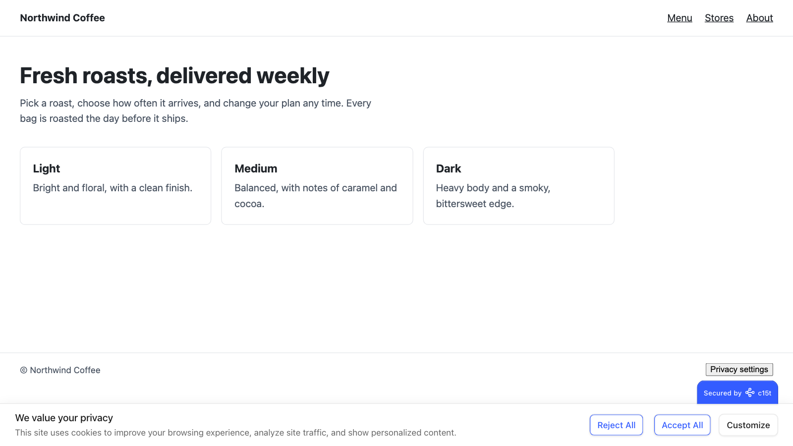
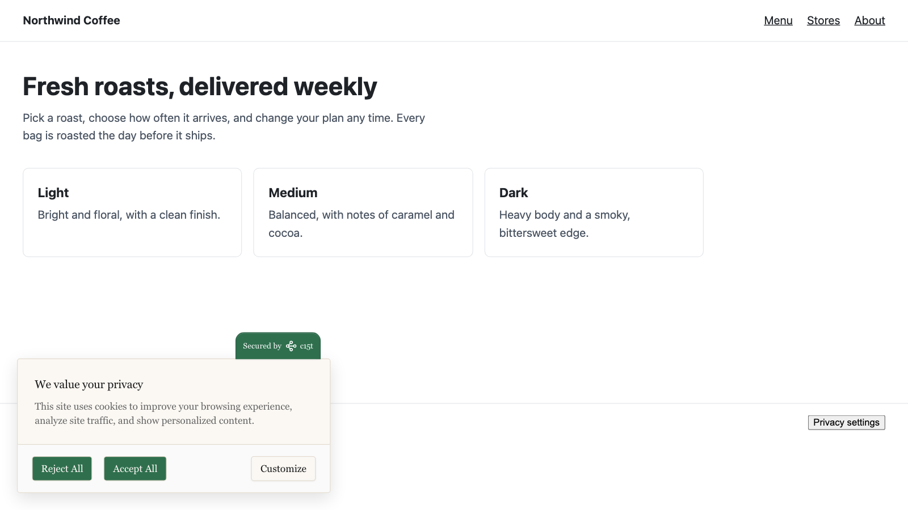
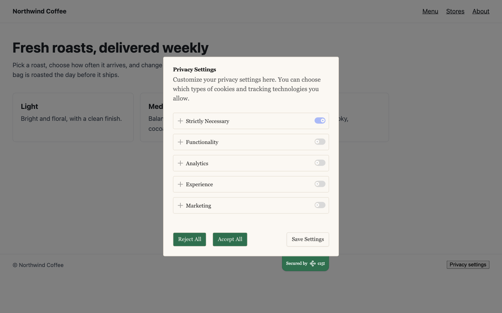
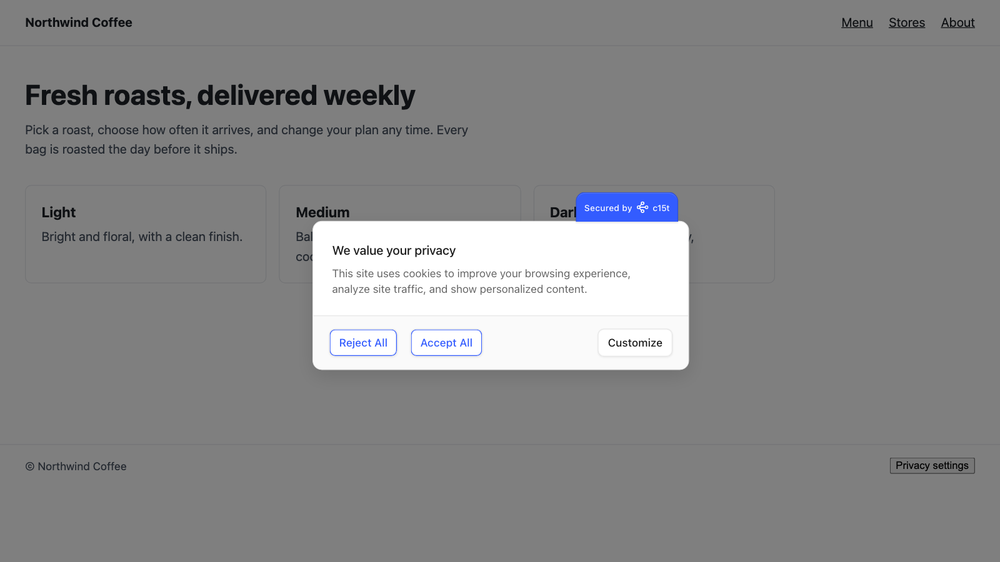
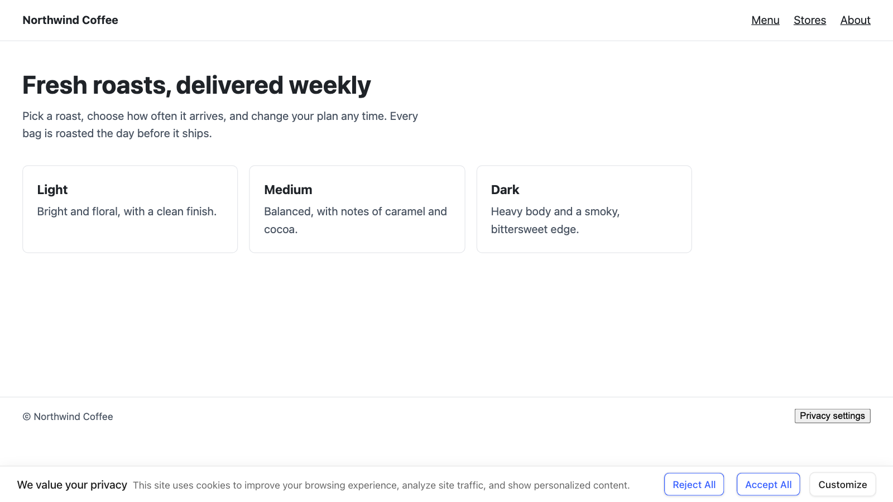
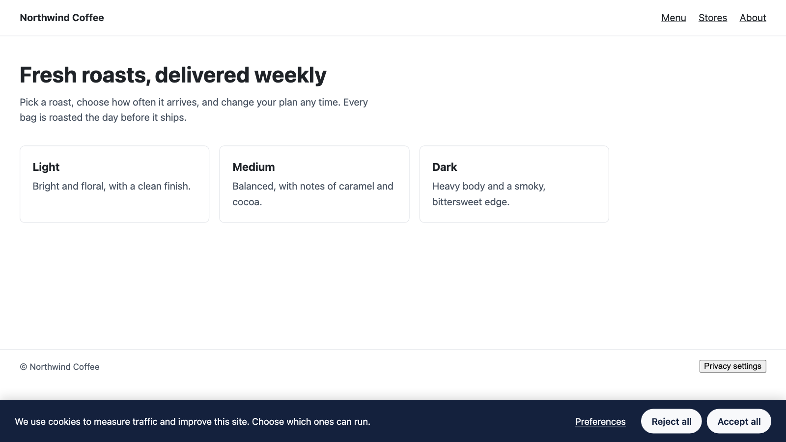
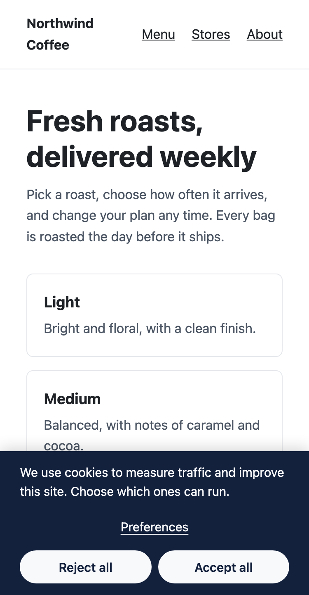
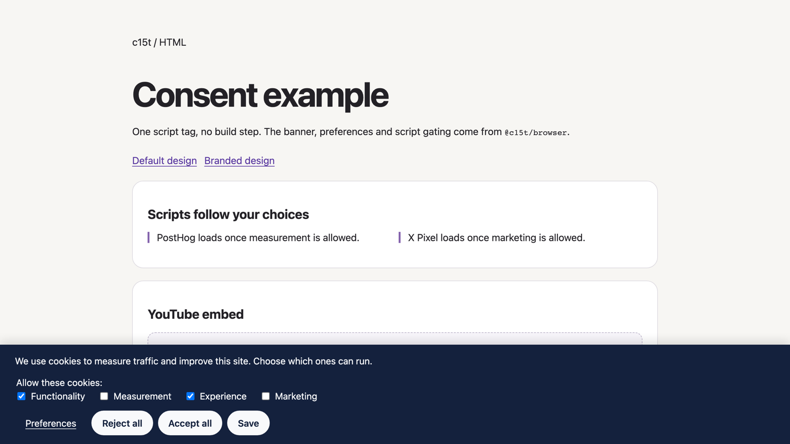

## Pick a design

Each design below is a real c15t banner. The screenshots and the code come from
the same Storybook stories, which CI runs to check that each design renders and
that Accept and Reject record a choice.

| Design | Customization level | Frameworks |
| --- | --- | --- |
| [Bottom bar](#bottom-bar) | Props | React, Vue, Astro, Svelte |
| [Branded card](#branded-card) | Theme tokens | React |
| [Choice wall](#choice-wall) | Props | React |
| [Slim bar](#slim-bar) | Compound parts or slots | React, Vue, Svelte |
| [Headless bar](#headless-bar) | Headless | React, Vue, Svelte, HTML |

Next.js and TanStack Start apps use the React code, with the same components
imported from `c15t/next` or `c15t/tanstack-start`. Nuxt uses the Vue code and
SvelteKit uses the Svelte code. [Customization](/docs/customization/overview)
explains when to use each level.

Every design keeps the policy in charge. The policy decides which buttons a
visitor gets, and none of these designs records consent until the visitor
clicks a button.

## Bottom bar



The stock banner becomes a full-width bar along the bottom edge with one prop,
`variant="bar"`. The title and copy sit on the left and the buttons on the
right.

<Tabs items={['React', 'Vue', 'Astro', 'Svelte']}>
  <Tab value="React">
    Render `CookieBanner` in place of `ConsentBanner`, inside your
    `ConsentProvider` and next to `ConsentDialog`.

    <include src="../shared/examples/storybook-react/bottom-bar.mdx" />
  </Tab>

  <Tab value="Vue">
    Render `CookieBanner` and `ConsentManager` from
    `c15t/vue/runtime/components/consent-manager.vue` in place of
    `ConsentRoot`. To keep `ConsentRoot`, set `presentation.prompt` in the
    `c15tVue` options instead, as in [customize](/docs/frameworks/vue/customize).

    <include src="../shared/examples/storybook-vue/bottom-bar.mdx" />
  </Tab>

  <Tab value="Astro">
    Add `presentation` to the `c15t()` options in `astro.config.mjs`. The
    server renders the banner as a bar.

    <include src="../shared/examples/storybook-astro/bottom-bar.mdx" />
  </Tab>

  <Tab value="Svelte">
    Render `CookieBanner` in place of `ConsentBanner`, inside
    `ConsentManagerProvider` and next to `ConsentDialog`.

    <include src="../shared/examples/storybook-svelte/bottom-bar.mdx" />
  </Tab>
</Tabs>

The HTML script tag takes the same shape through `presentation.prompt`. See
[customize the script tag](/docs/frameworks/html/customize#change-the-banners-shape-and-position).

## Branded card



Theme tokens change the colors, type and radius of the stock card without
touching its markup. This theme sets a green primary color, an off-white
surface, a serif font and four-pixel corners, and fills the actions the policy
marks as primary. Here the policy marks both Reject All and Accept All as
primary, so neither choice stands out.

<include src="../shared/examples/storybook-react/brand-theme.mdx" />

<include src="../shared/examples/storybook-react/brand-card.mdx" />

`ConsentTheme` renders the tokens as a `<style>` element. In a server-rendered
app, render it from a Server Component or the root layout so the tokens arrive
with the HTML. The provider's `theme` option reads only `consentActions` and
slot styles, so pass the same object there for the filled buttons:

{/* example: fragment */}

```tsx
<ConsentProvider options={{ mode, theme: brandTheme }}>
```

The preferences dialog reads the same tokens:



Vue, Svelte, Astro and the script tag set the same tokens their own way. See
customize for [Vue](/docs/frameworks/vue/customize),
[Svelte](/docs/frameworks/svelte/customize),
[Astro](/docs/frameworks/astro/customize) or
[HTML](/docs/frameworks/html/customize), and
[theme tokens](/docs/customization/tokens) for every token.

## Choice wall



`variant="wall"` centers the stock banner over a backdrop, locks scrolling and
traps focus until the visitor chooses. Use it only where a policy requires a
choice before the page is usable.

<include src="../shared/examples/storybook-react/choice-wall.mdx" />

A choice wall always blocks. A notice never blocks, so a wall requested for a
notice falls back to the floating card.

## Slim bar



The slim bar puts the title, the copy and the buttons on one row, so it is
shorter than the stock bar. React builds it from the
`ConsentBanner` compound parts. Vue and Svelte have no compound banner parts,
so they add classes to the stock bar's card and header through slots. All
three use the same stylesheet, and all three keep the buttons the policy
requires.

<Tabs items={['React', 'Vue', 'Svelte']}>
  <Tab value="React">
    `ConsentBanner.PolicyActions` renders the policy's buttons, so a required
    Reject button stays. Render `CookieBanner` inside your `ConsentProvider`,
    next to `ConsentDialog`.

    <include src="../shared/examples/storybook-react/slim-bar.mdx" />
  </Tab>

  <Tab value="Vue">
    Spread `slimBar` into the options you pass to `app.use(c15tVue, ...)`.
    `ConsentRoot` then renders the slim bar.

    <include src="../shared/examples/storybook-vue/slim-bar.mdx" />
  </Tab>

  <Tab value="Svelte">
    Spread `slimBar` into the options you pass to `ConsentManagerProvider`.
    Svelte scopes component styles, so the classes live in a global
    stylesheet.

    <include src="../shared/examples/storybook-svelte/slim-bar.mdx" />
  </Tab>
</Tabs>

<include src="../shared/examples/storybook-vue/slim-bar-css.mdx" />

## Headless bar



The headless bar is your own markup and CSS, driven by c15t's headless API. It
shows the same design in every framework. The policy still decides which
buttons appear and in what order, the Preferences button is always there, and
a choice is recorded only when the visitor clicks.

<Tabs items={['React', 'Vue', 'Svelte', 'HTML']}>
  <Tab value="React">
    `useHeadlessConsentUI()` from `c15t/react/headless` returns the banner
    state and `performAction`. Render `CookieBar` in place of
    `ConsentBanner`, and keep `ConsentDialog`, which Preferences opens.

    <include src="../shared/examples/storybook-react/headless-bar.mdx" />
  </Tab>

  <Tab value="Vue">
    The composables from `c15t/vue/vue-plugin` give the policy's actions and
    the active surface. Render `CookieBar` and `ConsentManager` in place of
    `ConsentRoot`. Preferences sets `activeUI` to `'manager'`, which opens
    `ConsentManager`.

    <include src="../shared/examples/storybook-vue/headless-bar.mdx" />
  </Tab>

  <Tab value="Svelte">
    `getHeadlessConsent()` returns the banner state and `performAction`.
    Render `CookieBar` in place of `ConsentBanner`, inside
    `ConsentManagerProvider`, and keep `ConsentDialog`, which Preferences
    opens.

    <include src="../shared/examples/storybook-svelte/headless-bar.mdx" />
  </Tab>

  <Tab value="HTML">
    The headless build, `c15t.headless.js`, keeps script gating and
    `window.c15t` and ships no banner, dialog or CSS. Buttons with
    `data-c15t-action` need no code. Because there is no stock dialog,
    Preferences opens category switches inside the bar and a Save button
    records them. Replace `https://your-project.inth.app` with the backend URL
    from your Inth project, and put the block before `</body>`.

    <include src="../shared/examples/script-tag/headless-bar.mdx" />
  </Tab>
</Tabs>

React, Vue and Svelte import the same stylesheet, `cookie-bar.css`. The HTML
block contains it inline.

<include src="../shared/examples/storybook-react/headless-bar-css.mdx" />

On a 375-pixel screen the copy takes the full width, Preferences sits on its
own line, and Reject all and Accept all share a row at equal width:



In the HTML version, Preferences opens the switches inside the bar:



A headless UI owns its focus handling and labels. Test it with a keyboard and
a screen reader. The headless pages for [React](/docs/frameworks/react/headless),
[Vue](/docs/frameworks/vue/headless) and [Svelte](/docs/frameworks/svelte/headless)
cover notices and custom preference forms.

## Check a design

Run these checks after you adopt a design:

1. Clear site data and reload. The banner appears and no optional vendor
   request appears in DevTools Network.
2. Click Reject all, reload, and confirm the banner stays closed and the
   vendors stay blocked.
3. Open preferences from your footer link, allow one category, save, and
   confirm only that category's vendors load.
4. Test a 375-pixel viewport with your longest translation, and tab through
   every button.

[Verify consent](/docs/guides/verify-consent) has the full list.

## Run the designs

The source repository renders each design in its Storybook under
`Docs / Banner designs`: `apps/storybook-react`, `apps/storybook-vue`,
`apps/storybook-svelte` and `apps/storybook-astro`. Each story uses an
in-memory policy and loads no analytics. The HTML headless bar runs at
`/consent-example/headless` in `examples/script-tag`, which the example
acceptance tests cover.
