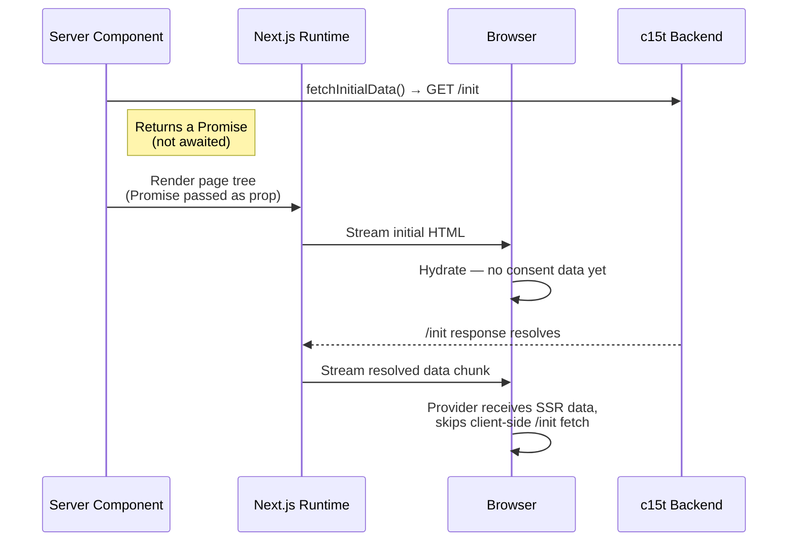

The `@c15t/nextjs` package provides `fetchInitialData`, a server-side function that fetches consent data before rendering. This enables SSR hydration — consent state is available immediately on page load without a client-side fetch, eliminating the consent banner flash.

<Callout type="info">
  SSR hydration is part of the [initialization flow](/docs/frameworks/next/concepts/initialization-flow#how-it-works). When SSR data is available, the client skips the API fetch entirely.
</Callout>

```ts
import { fetchInitialData } from '@c15t/nextjs';
```

## fetchInitialData

The primary function for fetching consent data on the server. It calls the c15t backend's `/init` endpoint with the user's request headers (resolved automatically from `next/headers`) and returns the initial consent data.

```ts title="app/layout.tsx"
import { fetchInitialData } from '@c15t/nextjs';

// In a Server Component — do NOT await
const ssrData = fetchInitialData({
  backendURL: '/api/c15t',
  debug: process.env.NODE_ENV === 'development',
});
```

<Callout type="warn">
  **Do not `await`** `fetchInitialData()` in Server Components. Pass the Promise directly to your client component so Next.js can stream the page while the consent data loads in parallel.
</Callout>

<Callout type="info">
  Need fully static routes? Use `C15tPrefetch` in your layout and `getPrefetchedInitialData()` in your client provider instead of `fetchInitialData()`. See [Optimization](/docs/frameworks/next/optimization).
</Callout>

### How Streaming Works

The diagram below shows how the prefetch avoids blocking the page render. The server fires the `/init` request and immediately starts streaming HTML — the resolved consent data is sent as a later chunk once the backend responds.



### Options

<AutoTypeTable path="./packages/nextjs/src/types.ts" name="FetchInitialDataOptions" />

### Return Value

Returns `Promise<SSRInitialData | undefined>`. The data includes the init response (jurisdiction, translations, consent model) and GVL data when IAB is configured.

### Passing SSR Data to the Provider

Pass the unresolved Promise to the provider's `ssrData` option via a client component:

```tsx title="components/consent-manager/index.tsx"
'use client';

import { type ReactNode } from 'react';
import { ConsentManagerProvider, ConsentBanner, ConsentDialog } from '@c15t/nextjs';
import type { InitialDataPromise } from '@c15t/nextjs';

export default function ConsentManager({
  children,
  ssrData,
}: {
  children: ReactNode;
  ssrData?: InitialDataPromise;
}) {
  return (
    <ConsentManagerProvider
      options={{
        mode: 'hosted',
        backendURL: '/api/c15t',
        store: { ssrData },
      }}
    >
      <ConsentBanner />
      <ConsentDialog />
      {children}
    </ConsentManagerProvider>
  );
}
```

```tsx title="app/layout.tsx"
import { fetchInitialData } from '@c15t/nextjs';
import ConsentManager from '@/components/consent-manager';

export default function RootLayout({ children }: { children: React.ReactNode }) {
  const ssrData = fetchInitialData({
    backendURL: '/api/c15t',
  });

  return (
    <html lang="en">
      <body>
        <ConsentManager ssrData={ssrData}>
          {children}
        </ConsentManager>
      </body>
    </html>
  );
}
```

## How Headers Are Resolved

Unlike `@c15t/react/server` where you must pass headers manually, `fetchInitialData` uses `next/headers` to automatically resolve the incoming request headers. This means geo-location headers from Vercel, Cloudflare, or AWS CloudFront are forwarded to the c15t backend without any extra configuration.

| Header | Source | Contains |
|--------|--------|----------|
| `cf-ipcountry` | Cloudflare | Country code |
| `x-vercel-ip-country` | Vercel | Country code |
| `x-amz-cf-ipcountry` | AWS CloudFront | Country code |
| `x-vercel-ip-country-region` | Vercel | Region code |
| `accept-language` | Browser | Language preference |
| `x-forwarded-host` | Proxy | Original host |
| `x-forwarded-for` | Proxy | Client IP |

## Advanced: Using @c15t/react/server Directly

For advanced use cases (custom server frameworks, edge functions, or non-standard header resolution), the underlying utilities from `@c15t/react/server` are available:

```ts
import {
  fetchSSRData,
  extractRelevantHeaders,
  normalizeBackendURL,
  validateBackendURL,
} from '@c15t/react/server';
```

See the [React Server-Side Utilities](/docs/frameworks/react/server-side) docs for full API details.

## Debugging SSR

Use the [useSSRStatus](/docs/frameworks/next/hooks/use-ssr-status) hook on the client to verify SSR data was consumed:

```tsx
import { useSSRStatus } from '@c15t/nextjs';

function DebugSSR() {
  const { ssrDataUsed, ssrSkippedReason } = useSSRStatus();

  if (ssrDataUsed) return <span>SSR hydration successful</span>;
  return <span>SSR skipped: {ssrSkippedReason ?? 'unknown'}</span>;
}
```
