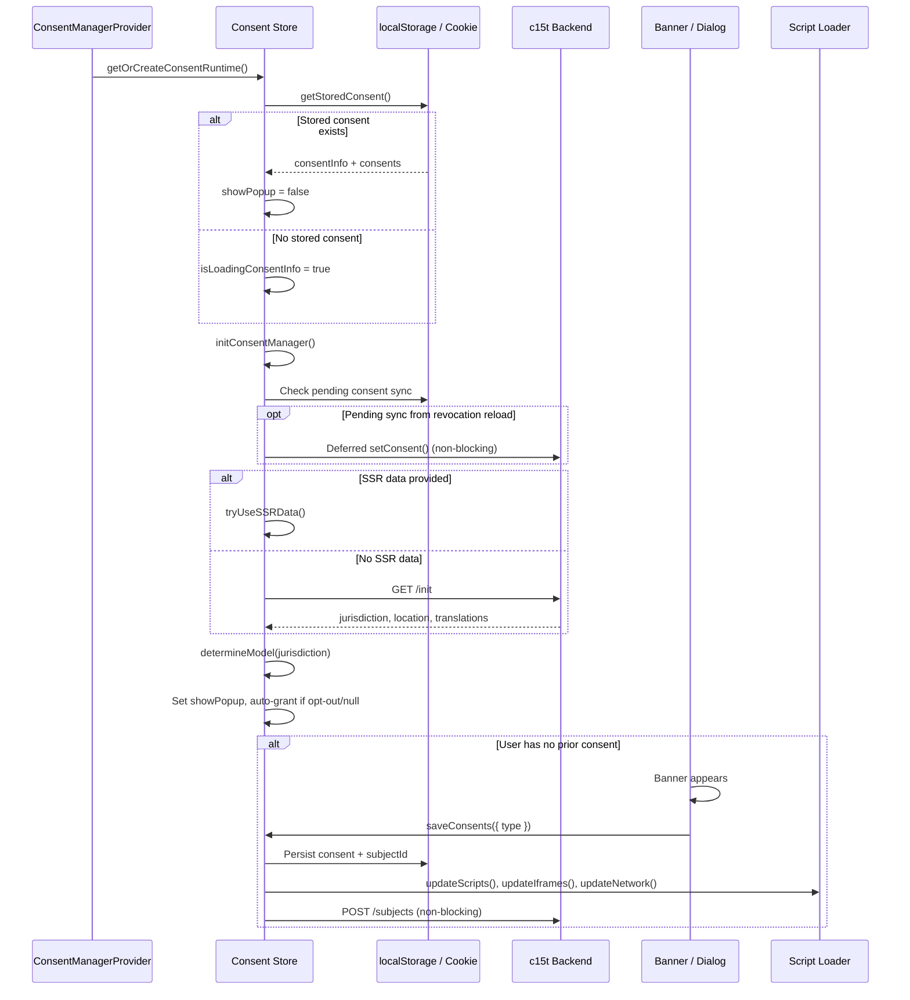

{/* This file is NOT rendered directly. Sections are imported by framework pages. */}

<section id="overview">
## Initialization Flow

When the consent provider mounts, it creates a cached consent runtime, reads any stored consent from the browser, fetches jurisdiction and translation data (via SSR or API), determines the applicable consent model, and decides whether to show the banner. This entire sequence completes before the first meaningful consent-aware render.
</section>

<section id="flow-diagram">
## Lifecycle Sequence

</section>

<section id="how-it-works">
## How It Works

**Mount** — When the provider renders, it creates (or retrieves from cache) a consent runtime and store. Any existing consent is read from localStorage/cookies immediately. If consent already exists, the banner stays hidden and gating rules apply right away. See [Client Modes](/docs/frameworks/react/concepts/client-modes) for how the mode affects runtime creation.

**Init** — The store fetches jurisdiction, location, and translation data. In `c15t` mode this calls `GET /init` on your backend; in `offline` mode it uses hardcoded defaults. If SSR data was passed to the provider, the network fetch is skipped entirely. See [Server-Side Utilities](/docs/frameworks/react/server-side) for SSR setup.

**Model resolution** — The jurisdiction from the init response is mapped to a consent model: `opt-in` (GDPR and similar), `opt-out` (CCPA), `iab` (TCF 2.3), or `null` (no regulation). For `opt-out` and `null` models, all categories are auto-granted — unless a Global Privacy Control signal is detected. See [Consent Models](/docs/frameworks/react/concepts/consent-models) for the full jurisdiction-to-model mapping.

**Save** — When the user interacts with the banner or dialog, their choices are persisted to localStorage/cookies and synced to the backend. Script, iframe, and network gating rules update immediately based on the new consent state. See the [Script Loader](/docs/frameworks/react/script-loader), [Iframe Blocking](/docs/frameworks/react/iframe-blocking), and [Network Blocker](/docs/frameworks/react/network-blocker) guides for gating details.

**Revocation** — If a user revokes a previously granted category, the page reloads by default to ensure a clean execution environment. The API sync is deferred to the fresh page load. See [Cookie Management](/docs/frameworks/react/concepts/cookie-management) for revocation and persistence details.
</section>

<section id="banner-visibility">
## When Does the Banner Show?

The banner appears when all three conditions are true:

1. **No existing consent** — the user has never consented (or their consent was cleared)
2. **A regulation applies** — the resolved model is `opt-in` or `iab` (not `null` or `opt-out`)
3. **Storage is accessible** — the browser allows localStorage (not blocked in private mode)

If the model is `null` (no regulation detected) or `opt-out`, consents are auto-granted and the banner never appears. See [Consent Models](/docs/frameworks/react/concepts/consent-models) for which jurisdictions map to which models.
</section>

<section id="debugging">
## Debugging the Lifecycle

Use the DevTools panel and callbacks to inspect each step of the initialization flow:

| Step | DevTools Panel | Callback | What to check |
|---|---|---|---|
| Init / SSR hydration | Location | `onBannerFetched` | jurisdiction, countryCode, regionCode populated? |
| Model resolution | Location | `onBannerFetched` | `model` value in store matches expected jurisdiction |
| Banner visibility | Consents | — | `showPopup` in store state; `consentInfo` null? |
| Consent save | Consents + Events | `onConsentSet` | `preferences` object in callback payload |
| Script loading | Scripts | `onConsentSet` | Script IDs and their load/blocked status |
| Reload on revocation | Events | `onBeforeConsentRevocationReload` | Fires before reload; check localStorage for `c15t:pending-consent-sync` |
| Deferred sync | Events | `onError` (if sync fails) | After reload, check Events panel for successful API call |
</section>
