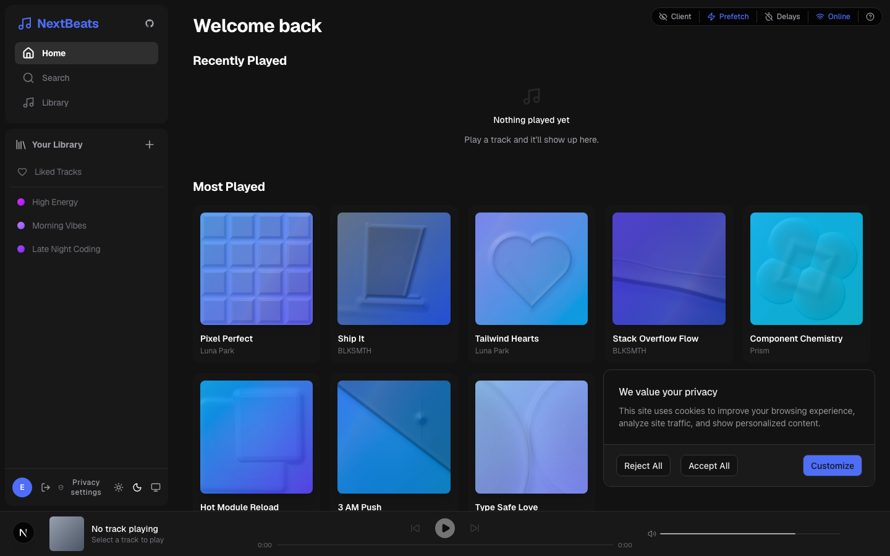

# c15t on an existing Next.js app: next-beats

This directory holds only the files added or changed to put the c15t v3
consent banner into [vercel-labs/next-beats](https://github.com/vercel-labs/next-beats)
at commit `c062a3421d03b336334254d15e1d28fa5ef5601f` (Next.js `16.3.1-canary.26`,
React `19.2.4`, Tailwind CSS 4, `cacheComponents: true`, pnpm). It is a
fresh-eyes check of `docs/frameworks/next/app-router.mdx` against an app that
already has a root layout, providers, a theme system and a fixed bottom bar,
which is how most people meet c15t. Nothing here is committed to the upstream
repository.



## Files

| Path | Role |
| --- | --- |
| `c15t.config.ts` | `defineConsentConfig` when `NEXT_PUBLIC_C15T_BACKEND_URL` is set; `null` otherwise so the app runs without an Inth project. |
| `app/api/c15t/manifest/route.ts` | Local manifest route from the App Router guide. |
| `components/consent.tsx` | Client `Consent` wrapper: `ConsentBoundary`, dark theme tokens taken from `app/globals.css`, banner slot classes that lift the card above the player bar, `offline()` fallback when no backend is configured. |
| `components/privacy-settings-link.tsx` | `ConsentDialogLink` rendered in the sidebar footer. |
| `components/sidebar.patch` | Six-line change to the upstream sidebar that mounts the link. |
| `lib/scripts.ts` | Consent-gated PostHog and X Pixel from `@c15t/scripts`, enabled by env. |
| `app/layout.tsx` | Root layout with the awaited `ResolvedConsent` Server Component inside `Suspense`. |
| `app/globals.css.patch` | One-line change: `@import 'c15t/next/styles.css'` after the Tailwind import, the stylesheet contract from the package README. |

## Apply on a fresh clone

```bash
git clone https://github.com/vercel-labs/next-beats app && cd app
git checkout c062a3421d03b336334254d15e1d28fa5ef5601f
pnpm add c15t @c15t/scripts   # v3 once published; see "Unreleased packages"
cp -r ../examples/next-beats-integration/{app,components,lib,c15t.config.ts} .
git apply ../examples/next-beats-integration/components/sidebar.patch \
  ../examples/next-beats-integration/app/globals.css.patch
pnpm dev
```

Without `NEXT_PUBLIC_C15T_BACKEND_URL` the app runs in offline mode: bundled
policy, browser storage, no consent records. Set the variable to an Inth or
self-hosted endpoint to use the hosted path from the guide.

## Unreleased packages

While v3 is unpublished, pack the workspace packages and install them as
files. From the c15t repository root after `bun run build`:

```bash
for p in c15t core dev-tools iab nextjs react schema scripts tanstack-start translations ui vue; do
  (cd packages/$p && bun pm pack --destination /tmp/c15t-tarballs)
done
```

Then point `c15t` and `@c15t/scripts` at the tarballs in `package.json` and add
a `pnpm.overrides` entry for every `@c15t/*` package so nothing resolves from
npm.

## What the walkthrough found

Each item is a docs or package follow-up; the issue or PR is linked where one
exists.

1. Importing `c15t/next/styles.css` from `layout.tsx`, as the guide showed,
   broke the banner styles under Tailwind 4: whichever stylesheet the bundler
   emitted first won, and Tailwind's preflight landed above c15t's
   `@layer components`. The package README's contract, `@import
   'c15t/next/styles.css'` in `app/globals.css` after `@import 'tailwindcss'`,
   fixes the order; the guide now says so.
2. With `cacheComponents: true`, Next.js 16 reported `Route "/": Next.js
   encountered the unstable value Date.now() while prerendering` from
   `prefetchInitialConsent`, even though the helper awaits `headers()` first.
   `await connection()` before the call is the workaround used here.
3. `docs/frameworks/next/styling/overview.mdx` imported `defineTheme` from
   `@c15t/ui/theme`. `@c15t/ui` is a transitive dependency, so pnpm refuses
   the import (`Module not found`). The umbrella already exposes it as
   `c15t/react/types`; the docs now import from there.
4. The umbrella `c15t` package installs `@c15t/vue` and `@c15t/tanstack-start`
   into a Next.js app as regular dependencies.
5. The floating banner overlapped the app's fixed `NowPlayingBar`. The
   `components.banner.root.className` slot fixed it; the styling page does not
   show a "clear a fixed footer" example.
6. The default `c15t.config.ts` throws when the env variable is missing, and
   the offline path is documented only in the reference page. A reader without
   an account has to search for it.
