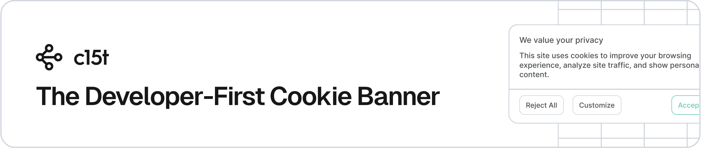

<p align="center">
  <a href="https://c15t.com?utm_source=github&utm_medium=repopage_%40c15t%2Fcli" target="_blank" rel="noopener noreferrer">
    <picture>
      <source media="(prefers-color-scheme: dark)" srcset="../../docs/assets/c15t-banner-readme-dark.svg">
      
    </picture>
  </a>
  <br />
  <h1 align="center">@c15t/cli: c15t's CLI</h1>
</p>

[](https://github.com/c15t/c15t)
[](https://github.com/c15t/c15t/actions/workflows/ci.yml)
[](https://github.com/c15t/c15t/blob/main/LICENSE.md)
[](https://c15t.com/discord)
[](https://www.npmjs.com/package/@c15t/cli)
[](https://github.com/c15t/c15t)
[](https://github.com/c15t/c15t/commits/main)
[](https://github.com/c15t/c15t/issues)

CLI for rapid c15t setup. Scaffold React and Next.js cookie banners and a preferences centre, generate types and config, and run migration tooling for self-hosted deployments.

## Key Features

- Configuration Generation: Automatically generate schema and code for consent management
- Database Migrations: Simplified database schema updates
- Multi-Framework Support: Works seamlessly across different web frameworks
- Interactive CLI: User-friendly command-line interface with guided workflows
- GitHub Integration: Easy way to star and support the project
- Documentation Access: Quick access to project documentation

## Prerequisites

- Node.js 18.17.0 or later
- npm, pnpm, or yarn package manager

## Quick Start

Easiest setup with @c15t/cli:

```bash
# Generate schema and code
pnpm dlx @c15t/cli generate
# Alternatives:
# npx @c15t/cli generate
# bunx --bun @c15t/cli generate
```

The CLI will:

- Install necessary packages
- Configure your c15t instance
- Set up environment variables
- Add consent management components to your app

## Usage

1. Run `@c15t/cli generate` to create initial configuration
2. Customize consent settings in generated files
3. Integrate with your web application
4. Use `@c15t/cli migrate` for database schema updates

## Available Commands

- `generate`: Generate schema/code based on your c15t config
- `migrate`: Run database migrations based on your c15t config
- `github`: Open the project's GitHub repository to star the project
- `docs`: Open the c15t documentation in your browser

## Global Flags

- `--help`: Display help menu
- `--version`: Show CLI version
- `--no-telemetry`: Disable anonymous usage data collection

## Telemetry

Anonymous usage data collection to help improve the CLI

- Not personally identifiable
- Used to prioritize features and improvements
- Completely optional

Disable telemetry by:

- Use the `--no-telemetry` flag
- Set `C15T_TELEMETRY_DISABLED=1` in your environment

## Documentation

For further information, guides, and examples visit the [reference documentation](https://c15t.com/docs/cli/overview).

## Support

- Join our [Discord community](https://c15t.com/discord)
- Open an issue on our [GitHub repository](https://github.com/c15t/c15t/issues)
- Visit [consent.io](https://consent.io) and use the chat widget
- Contact our support team via email [support@consent.io](mailto:support@consent.io)

## Contributing

- We're open to all community contributions!
- Read our [Contribution Guidelines](https://c15t.com/docs/oss/contributing)
- Review our [Code of Conduct](https://c15t.com/docs/oss/code-of-conduct)
- Fork the repository
- Create a new branch for your feature
- Submit a pull request
- **All contributions, big or small, are welcome and appreciated!**

## Security

If you believe you have found a security vulnerability in c15t, we encourage you to **_responsibly disclose this and NOT open a public issue_**. We will investigate all legitimate reports.

Our preference is that you make use of GitHub's private vulnerability reporting feature to disclose potential security vulnerabilities in our Open Source Software. To do this, please visit [https://github.com/c15t/c15t/security](https://github.com/c15t/c15t/security) and click the "Report a vulnerability" button.

### Security Policy

- Please do not share security vulnerabilities in public forums, issues, or pull requests
- Provide detailed information about the potential vulnerability
- Allow reasonable time for us to address the issue before any public disclosure
- We are committed to addressing security concerns promptly and transparently

## License

[GNU General Public License v3.0](https://github.com/c15t/c15t/blob/main/LICENSE.md)

---

**Built with ❤️ by the [consent.io](https://www.consent.io) team**
