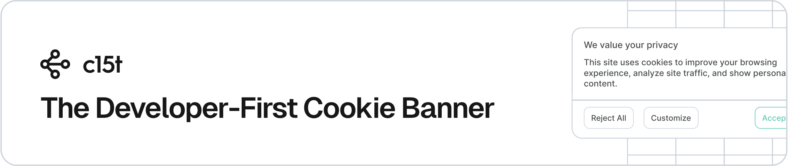

<p align="center">
  <a href="https://c15t.com?utm_source=npm&utm_medium=readme&utm_campaign=oss_readme&utm_content=%40c15t%2Fnode-sdk" target="_blank" rel="noopener noreferrer">
    <picture>
      <source media="(prefers-color-scheme: dark)" srcset="../../docs/assets/c15t-banner-readme-dark.svg" type="image/svg+xml">
      
    </picture>
  </a>
</p>

# @c15t/node-sdk: Type-Safe Node.js API Client

[](https://github.com/c15t/c15t)
[](https://github.com/c15t/c15t/actions/workflows/ci.yml)
[](https://github.com/c15t/c15t/blob/main/LICENSE.md)
[](https://c15t.link/discord)
[](https://www.npmjs.com/package/@c15t/node-sdk)
[](https://github.com/c15t/c15t)
[](https://github.com/c15t/c15t/commits/main)
[](https://github.com/c15t/c15t/issues)

A fully typed, flexible Node.js SDK for seamless interaction with the c15t consent management platform API.

## Key Features

- Type-safe API client with full TypeScript support
- Flexible client configuration with authentication and custom headers
- Supports dynamic base URL and API prefix configuration
- Built on top of @orpc/client for robust API interactions
- Easy integration with Node.js applications
- Comprehensive error handling and URL validation

## Prerequisites

- Node.js 18.17.0 or later
- A Hosted [c15t instance](https://inth.com) (free sign-up) or [self-hosted deployment](https://c15t.com/docs/self-host/v2)

## Manual Installation

```bash
pnpm add @c15t/node-sdk
```

## Usage

1. Import `c15tClient` from `@c15t/node-sdk`
2. Configure with a base URL and token, or set `C15T_API_URL` and `C15T_API_TOKEN` so the client picks them up automatically
3. Call API methods on `client.meta`, `client.subjects`, etc. — every method is fully typed

```ts
// server.ts
import { c15tClient } from '@c15t/node-sdk'

// Auto-configure from C15T_API_URL + C15T_API_TOKEN env vars
const client = c15tClient()

// Or pass options explicitly
// const client = c15tClient({
//   baseUrl: process.env.C15T_API_URL!,
//   token: process.env.C15T_API_TOKEN!,
// })

try {
  const status = await client.meta.status()
  console.log('c15t API status:', status)

  const subject = await client.subjects.create({
    type: 'cookie_banner',
    subjectId: 'sub_123',
    domain: 'example.com',
    preferences: { analytics: true },
    givenAt: Date.now(),
  })
  console.log('Created subject', subject.id)
} catch (error) {
  console.error('c15t request failed:', error)
}
```

## Support

- Join our [Discord community](https://c15t.link/discord)
- Open an issue on our [GitHub repository](https://github.com/c15t/c15t/issues)
- Visit [inth.com](https://inth.com) and use the chat widget
- Contact our support team via email [support@inth.com](mailto:support@inth.com)

## Contributing

- We're open to all community contributions.
- Read our [Contribution Guidelines](https://c15t.com/docs/oss/contributing)
- Review our [Code of Conduct](https://c15t.com/docs/oss/code-of-conduct)
- Fork the repository
- Create a new branch for your feature
- Submit a pull request
- **All contributions, big or small, are welcome and appreciated.**

## Security

If you believe you have found a security vulnerability in c15t, we encourage you to **_responsibly disclose this and NOT open a public issue_**. We will investigate all legitimate reports.

Our preference is that you make use of GitHub's private vulnerability reporting feature to disclose potential security vulnerabilities in our open-source software. To do this, please visit [https://github.com/c15t/c15t/security](https://github.com/c15t/c15t/security) and click the "Report a vulnerability" button.

### Security Policy

- Please do not share security vulnerabilities in public forums, issues, or pull requests
- Provide detailed information about the potential vulnerability
- Allow reasonable time for us to address the issue before any public disclosure
- We are committed to addressing security concerns promptly and transparently

## License

[Apache License 2.0](https://github.com/c15t/c15t/blob/main/LICENSE.md)

---

**Built by [Inth](https://inth.com?utm_source=npm&utm_medium=readme&utm_campaign=oss_readme&utm_content=%40c15t%2Fnode-sdk)**
