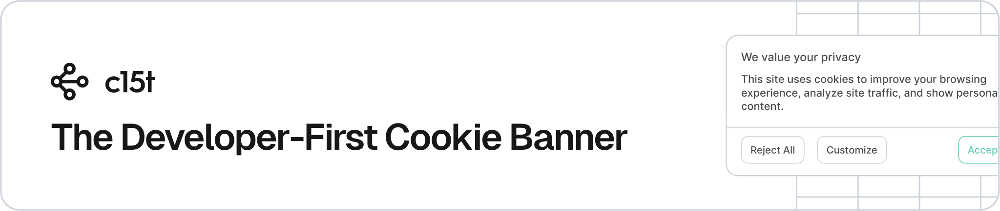

<p align="center">
  <a href="https://c15t.com?utm_source=npm&utm_medium=readme&utm_campaign=oss_readme&utm_content=%40c15t%2Fnode-sdk" target="_blank" rel="noopener noreferrer">
    <picture>
      <source media="(prefers-color-scheme: dark)" srcset="../../docs/assets/c15t-banner-readme-dark.svg" type="image/svg+xml">
      
    </picture>
  </a>
</p>

# @c15t/node-sdk: Node.js client for the c15t consent API

<p>
<a href="https://www.npmjs.com/package/@c15t/node-sdk"><picture><source media="(prefers-color-scheme: dark)" srcset="https://shieldcn.dev/npm/%40c15t%2Fnode-sdk.svg?variant=outline&mode=dark"></picture></a>
<a href="https://github.com/c15t/c15t"><picture><source media="(prefers-color-scheme: dark)" srcset="https://shieldcn.dev/github/c15t/c15t/stars.svg?variant=outline&mode=dark"></picture></a>
<a href="https://github.com/c15t/c15t/blob/main/LICENSE.md"><picture><source media="(prefers-color-scheme: dark)" srcset="https://shieldcn.dev/github/c15t/c15t/license.svg?variant=outline&mode=dark"></picture></a>
<a href="https://c15t.link/discord"><picture><source media="(prefers-color-scheme: dark)" srcset="https://shieldcn.dev/discord/1312171102268690493.svg?variant=outline&mode=dark"></picture></a>
<a href="https://skills.sh/c15t/skills/c15t"><picture><source media="(prefers-color-scheme: dark)" srcset="https://shieldcn.dev/skills/c15t/skills/c15t.svg?variant=outline&mode=dark"></picture></a>
<a href="https://inth.com?utm_source=npm&utm_medium=readme&utm_campaign=oss_readme&utm_content=%40c15t%2Fnode-sdk"><picture><source media="(prefers-color-scheme: dark)" srcset="https://shieldcn.dev/badge/Made%20By-Inth-ffc803.svg?color=ffc803&labelTextColor=000000&logo=data%3Aimage%2Fsvg%2Bxml%3Bbase64%2CPHN2ZyB4bWxucz0iaHR0cDovL3d3dy53My5vcmcvMjAwMC9zdmciIGZpbGw9Im5vbmUiIHZpZXdCb3g9IjAgMCAzOTMgNDAwIj48cGF0aCBmaWxsPSIjMDAwIiBkPSJNMTgyLjY2MiAwdjM2Ljg5NWgtNTkuMDMxdjgyLjczM2g1OS4wMzF2MzYuODkzSDI3LjQ4MnYtMzYuODkzaDU5LjAzVjM2Ljg5NWgtNTkuMDNWMHpNMzIxLjk0MSA4OS44NVYwaDM1LjM1NXYxNTYuNTIxaC0yNS43MTNsLTg2LjEzNy05MC4zNjR2OTAuMzY0aC0zNS4zNTVWMGgyNi4zNTV6Ii8%2BPHBhdGggZmlsbD0iIzAwMCIgZmlsbC1ydWxlPSJldmVub2RkIiBkPSJNMzE4LjU3MSAxODUuNzE0aDc0LjI4NlY0MDBIMFYxODUuNzE0aDI3Mi44NTd2LTQ3LjE0M3ptLTI5MS4wOSAyOC45Njl2MzcuMTE4aDU4LjEzN3YxMTkuNjI4aDM2Ljg5NVYyNTEuODAxaDU4LjU4NHYtMzcuMTE4em0xODIuNjEuMjI0djE1Ni41MjJoMzYuODk0VjMxMy41OWg3My4zNDF2NTcuODM5aDM3LjExOFYyMTQuOTA3aC0zNy4xMTh2NjEuNzg4aC03My4zNDF2LTYxLjc4OHoiIGNsaXAtcnVsZT0iZXZlbm9kZCIvPjwvc3ZnPg%3D%3D&valueColor=000000&mode=dark"></picture></a>
</p>

Typed client for hosted and self-hosted c15t backends. Check consent before sending email, link users after sign-in, export a user's consent records, publish legal document releases from CI and read banner experiment results.

## Key Features

- One `createC15tClient()` call with an explicit backend URL. No environment variables are read
- Methods resolve to `{ ok: true, data }` or `{ ok: false, error }` and never reject. Error codes are typed per method
- Key-only methods (`subjects.list`, `experiments.summary`, `legalDocuments.publish`) exist only on a client created with an API key
- Input is validated before anything is sent, and response dates are `Date` objects
- Per-attempt timeouts and retries for network errors, timeouts and 408, 429, 500, 502, 503 and 504, honouring `Retry-After`
- A typed mock client in `@c15t/node-sdk/testing`

## Prerequisites

- Node.js 20.19 or later, or another runtime with `fetch`, `AbortSignal.any` and `crypto.randomUUID`
- A hosted [c15t instance](https://inth.com) or a [self-hosted backend](https://c15t.com/docs/self-host/quickstart)

## Manual Installation

```bash
pnpm add @c15t/node-sdk@alpha
```

## Usage

1. Create a client with the URL where the backend is mounted, path included. Pass `apiKey` for the key-only methods
2. Call a method and check `result.ok` before reading `result.data`, or use `unwrap(result)` to throw the error instead

```ts
// server.ts
import { createC15tClient } from '@c15t/node-sdk';

const apiKey = process.env.C15T_API_KEY;
if (!apiKey) throw new Error('Set C15T_API_KEY');

const c15t = createC15tClient({
  baseUrl: 'https://app.example.com/api/c15t',
  apiKey,
});

const result = await c15t.consents.check({
  externalId: user.id,
  types: ['marketing_communications'],
});

if (result.ok && result.data.results.marketing_communications.hasConsent) {
  await sendNewsletter(user);
} else if (!result.ok) {
  console.error(result.error.code, result.error.requestId);
}
```

## Documentation

For further information, guides, and examples visit the [reference documentation](https://c15t.com/docs/self-host/api/node-sdk).

## Methods

| Method | API key |
| --- | --- |
| `consents.check({ externalId, types })` | No |
| `subjects.identify(id, { externalId, identityProvider })` | No |
| `subjects.get(id, { types })` | No |
| `subjects.create(input)` | No |
| `subjects.list({ externalId })` | Required |
| `legalDocuments.publish(type, { version, hash, effectiveDate })` | Required |
| `experiments.summary(id, { from, to, domain })` | Required |
| `status()`, `init()`, `manifest()` | No |

Every method takes `{ signal, timeoutMs, headers, retry, requestId }` as its last argument.

## Upgrading from v2

`c15tClient()` and the `C15TClient` class are replaced by `createC15tClient()`. Results replace `ResponseContext`, `C15TError` is now `C15tError`, and `subjects.patch` is now `subjects.identify`. See the [migration guide](https://c15t.com/docs/upgrade-v3#update-the-nodejs-sdk).

## Support

- Join our [Discord community](https://c15t.link/discord)
- Open an issue on our [GitHub repository](https://github.com/c15t/c15t/issues)
- Visit [inth.com](https://inth.com) and use the chat widget
- Contact our support team via email [support@inth.com](mailto:support@inth.com)

## Contributing

- We're open to all community contributions.
- Read our [Contribution Guidelines](https://c15t.com/docs/oss/contributing)
- Review our [Code of Conduct](https://c15t.com/docs/oss/code-of-conduct)
- Fork the repository
- Create a new branch for your feature
- Submit a pull request
- **All contributions, big or small, are welcome and appreciated.**

## Security

If you believe you have found a security vulnerability in c15t, we encourage you to **_responsibly disclose this and NOT open a public issue_**. We will investigate all legitimate reports.

Our preference is that you make use of GitHub's private vulnerability reporting feature to disclose potential security vulnerabilities in our open-source software. To do this, please visit [https://github.com/c15t/c15t/security](https://github.com/c15t/c15t/security) and click the "Report a vulnerability" button.

### Security Policy

- Please do not share security vulnerabilities in public forums, issues, or pull requests
- Provide detailed information about the potential vulnerability
- Allow reasonable time for us to address the issue before any public disclosure
- We are committed to addressing security concerns promptly and transparently

## License

[Apache License 2.0](https://github.com/c15t/c15t/blob/main/LICENSE.md)

---

**Built by [Inth](https://inth.com?utm_source=npm&utm_medium=readme&utm_campaign=oss_readme&utm_content=%40c15t%2Fnode-sdk)**
