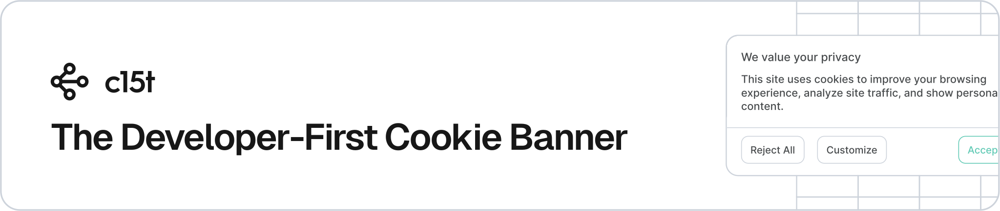

<p align="center">
  <a href="https://c15t.com?utm_source=npm&utm_medium=readme&utm_campaign=oss_readme&utm_content=%40c15t%2Ftanstack-start" target="_blank" rel="noopener noreferrer">
    <picture>
      <source media="(prefers-color-scheme: dark)" srcset="../../docs/assets/c15t-banner-readme-dark.svg" type="image/svg+xml">
      
    </picture>
  </a>
</p>

# @c15t/tanstack-start: TanStack Start Integration

<p>
<a href="https://www.npmjs.com/package/@c15t/tanstack-start"><picture><source media="(prefers-color-scheme: dark)" srcset="https://shieldcn.dev/npm/%40c15t%2Ftanstack-start.svg?variant=outline&mode=dark"></picture></a>
<a href="https://github.com/c15t/c15t"><picture><source media="(prefers-color-scheme: dark)" srcset="https://shieldcn.dev/github/c15t/c15t/stars.svg?variant=outline&mode=dark"></picture></a>
<a href="https://github.com/c15t/c15t/blob/main/LICENSE.md"><picture><source media="(prefers-color-scheme: dark)" srcset="https://shieldcn.dev/github/c15t/c15t/license.svg?variant=outline&mode=dark"></picture></a>
<a href="https://c15t.link/discord"><picture><source media="(prefers-color-scheme: dark)" srcset="https://shieldcn.dev/discord/1312171102268690493.svg?variant=outline&mode=dark"></picture></a>
<a href="https://skills.sh/c15t/skills/c15t"><picture><source media="(prefers-color-scheme: dark)" srcset="https://shieldcn.dev/skills/c15t/skills/c15t.svg?variant=outline&mode=dark"></picture></a>
<a href="https://inth.com?utm_source=npm&utm_medium=readme&utm_campaign=oss_readme&utm_content=%40c15t%2Ftanstack-start"><picture><source media="(prefers-color-scheme: dark)" srcset="https://shieldcn.dev/badge/Made%20By-Inth-ffc803.svg?color=ffc803&labelTextColor=000000&logo=data%3Aimage%2Fsvg%2Bxml%3Bbase64%2CPHN2ZyB4bWxucz0iaHR0cDovL3d3dy53My5vcmcvMjAwMC9zdmciIGZpbGw9Im5vbmUiIHZpZXdCb3g9IjAgMCAzOTMgNDAwIj48cGF0aCBmaWxsPSIjMDAwIiBkPSJNMTgyLjY2MiAwdjM2Ljg5NWgtNTkuMDMxdjgyLjczM2g1OS4wMzF2MzYuODkzSDI3LjQ4MnYtMzYuODkzaDU5LjAzVjM2Ljg5NWgtNTkuMDNWMHpNMzIxLjk0MSA4OS44NVYwaDM1LjM1NXYxNTYuNTIxaC0yNS43MTNsLTg2LjEzNy05MC4zNjR2OTAuMzY0aC0zNS4zNTVWMGgyNi4zNTV6Ii8%2BPHBhdGggZmlsbD0iIzAwMCIgZmlsbC1ydWxlPSJldmVub2RkIiBkPSJNMzE4LjU3MSAxODUuNzE0aDc0LjI4NlY0MDBIMFYxODUuNzE0aDI3Mi44NTd2LTQ3LjE0M3ptLTI5MS4wOSAyOC45Njl2MzcuMTE4aDU4LjEzN3YxMTkuNjI4aDM2Ljg5NVYyNTEuODAxaDU4LjU4NHYtMzcuMTE4em0xODIuNjEuMjI0djE1Ni41MjJoMzYuODk0VjMxMy41OWg3My4zNDF2NTcuODM5aDM3LjExOFYyMTQuOTA3aC0zNy4xMTh2NjEuNzg4aC03My4zNDF2LTYxLjc4OHoiIGNsaXAtcnVsZT0iZXZlbm9kZCIvPjwvc3ZnPg%3D%3D&valueColor=000000&mode=dark"></picture></a>
</p>

TanStack Start cookie banner and consent management platform with SSR-hydrated first paint, same-origin consent routes, request middleware, and headless consent flows.

## Key Features

- Works with TanStack Start and TanStack Router 1.x
- Root route loader hands the server-resolved consent config to the client, so the first paint already shows the right banner
- Same-origin manifest and init server routes with in-process caching, ETag passthrough, and no self-fetch during SSR
- Request middleware that normalizes CDN geo, language, and Global Privacy Control headers for every request
- Static helpers for prerendered builds: strictest policy first, client-side geo fix-up afterwards
- Prebuilt and customizable cookie banner, consent dialog, and preference center UI
- Headless hooks for custom consent flows
- IAB TCF 2.3 UI and hooks through the @c15t/react/iab subpath
- Google Tag Manager, Google Consent Mode v2, Meta Pixel, and analytics integrations through @c15t/scripts
- Built-in internationalization support

## Prerequisites

- TanStack Start 1.168 or later and TanStack Router 1.170 or later
- React 18 or later
- Node.js 20.19 or later
- A hosted [c15t instance](https://inth.com) (free sign-up), [self-hosted deployment](https://c15t.com/docs/self-host/quickstart), or offline mode for local-only storage

## Manual Installation

```bash
pnpm add @c15t/tanstack-start
```

Then add the prebuilt stylesheet to your app-level CSS entrypoint:

```css
/* src/styles.css */
@import "@c15t/tanstack-start/styles.css";
```

To manually install, follow the guide in our [docs – manual setup](https://c15t.com/docs/frameworks/tanstack-start/quickstart#manual-installation).

## Usage

1. Mount the consent server route so the client has same-origin `manifest` and `init` endpoints (the snippets below use this default; optionally add `proxy: true` and point `ConsentBoundary` at `/api/c15t` to also route consent saves through it)
2. Resolve the consent config in the root route loader with a server function
3. Wrap the app in `ConsentBoundary` and add `ConsentBanner` and `ConsentDialog`
4. For full implementation details, see the [TanStack Start quickstart docs](https://c15t.com/docs/frameworks/tanstack-start/quickstart)

```tsx
// src/routes/api/c15t/$.ts
import { createFileRoute } from '@tanstack/react-router';
import { createConsentServerRoute } from '@c15t/tanstack-start/api';

export const Route = createFileRoute('/api/c15t/$')({
  server: {
    handlers: createConsentServerRoute({
      backendURL: 'https://your-instance.c15t.dev',
    }),
  },
});
```

```tsx
// src/routes/__root.tsx
import { createRootRoute, Outlet } from '@tanstack/react-router';
import { createServerFn } from '@tanstack/react-start';
import {
  ConsentBanner,
  ConsentBoundary,
  ConsentDialog,
} from '@c15t/tanstack-start';
import {
  consentLoaderOptions,
  createConsentConfigHandler,
} from '@c15t/tanstack-start/server';

const getConsentConfig = createServerFn({ method: 'GET' }).handler(
  createConsentConfigHandler({ backendURL: 'https://your-instance.c15t.dev' })
);

export const Route = createRootRoute({
  ...consentLoaderOptions,
  loader: () => getConsentConfig(),
  component: RootComponent,
});

function RootComponent() {
  const config = Route.useLoaderData();
  return (
    <ConsentBoundary config={config} backendURL="https://your-instance.c15t.dev">
      <ConsentBanner />
      <ConsentDialog />
      <Outlet />
    </ConsentBoundary>
  );
}
```

## Documentation

For further information, guides, and examples visit the [reference documentation](https://c15t.com/docs/frameworks/tanstack-start/quickstart).

## Deployment Modes

- **Hosted on inth.com**: Hosted c15t backend for policy storage, audit history, and hosted infrastructure
- **Self-hosted backend**: Use @c15t/backend with your own database and infrastructure
- **Offline mode**: Browser-only consent storage for local development, demos, previews, static sites, or fallback scenarios

## Popular Integrations

- Google Tag Manager with Google Consent Mode v2
- Google Analytics 4 and Google Ads through gtag.js
- Meta Pixel, TikTok Pixel, LinkedIn Insights, Microsoft UET, X Pixel, Reddit Pixel, and Snapchat Pixel
- PostHog, Segment, Mixpanel, Microsoft Clarity, Hotjar, Plausible, Fathom, Matomo, Umami, and Vercel Analytics
- Intercom and Crisp chat widgets

## Support

- Join our [Discord community](https://c15t.link/discord)
- Open an issue on our [GitHub repository](https://github.com/c15t/c15t/issues)
- Visit [inth.com](https://inth.com) and use the chat widget
- Contact our support team via email [support@inth.com](mailto:support@inth.com)

## Contributing

- We're open to all community contributions.
- Read our [Contribution Guidelines](https://c15t.com/docs/oss/contributing)
- Review our [Code of Conduct](https://c15t.com/docs/oss/code-of-conduct)
- Fork the repository
- Create a new branch for your feature
- Submit a pull request
- **All contributions, big or small, are welcome and appreciated.**

## Security

If you believe you have found a security vulnerability in c15t, we encourage you to **_responsibly disclose this and NOT open a public issue_**. We will investigate all legitimate reports.

Our preference is that you make use of GitHub's private vulnerability reporting feature to disclose potential security vulnerabilities in our open-source software. To do this, please visit [https://github.com/c15t/c15t/security](https://github.com/c15t/c15t/security) and click the "Report a vulnerability" button.

### Security Policy

- Please do not share security vulnerabilities in public forums, issues, or pull requests
- Provide detailed information about the potential vulnerability
- Allow reasonable time for us to address the issue before any public disclosure
- We are committed to addressing security concerns promptly and transparently

## License

[Apache License 2.0](https://github.com/c15t/c15t/blob/main/LICENSE.md)

---

**Built by [Inth](https://inth.com?utm_source=npm&utm_medium=readme&utm_campaign=oss_readme&utm_content=%40c15t%2Ftanstack-start)**
